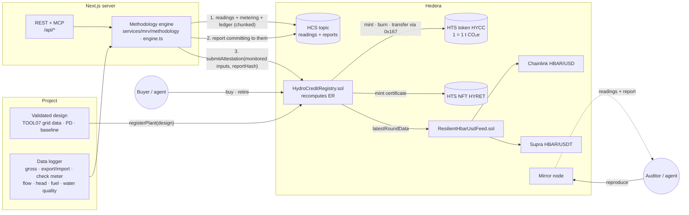

# Hydro dMRV — a Scaffold-HBAR template

**Carbon credits for grid-connected hydropower whose every gram is computed by the methodology, recomputed on-chain
and reproducible from public data.** A deterministic engine implements Verra **VMR0017 v1.0** (April 2026) applied with
**ACM0002 v22.0**, and the CDM rules (**AMS-I.D** ≤ 15 MW, **ACM0002**), with **TOOL07** (grid emission factor) and
**TOOL03** (fossil fuel combustion): `ER = BE − PE − LE`, with project
emissions, leakage, retrofit baselines, the reservoir power-density rule and conservative QA/QC. Monitoring data and
reports are published on the **Hedera Consensus Service**. The `HydroCreditRegistry` contract stores each plant's
validated design, recomputes the emission reductions itself and mints **Hedera Token Service** credits
(1 token = 1 t CO₂e). Sales are priced in USD and settled in HBAR through **Chainlink HBAR/USD**, cross-checked
against a **Supra** fallback; every retirement mints an **HTS NFT certificate**.

```bash
npm create scaffold-hbar@latest --template BikramBiswas786/Hedera-hydropower-dMRV-with-5-layer-verification-
```

**Live on Hedera testnet: [hydro-dmrv.vercel.app](https://hydro-dmrv.vercel.app)** (read-only; MCP at
`https://hydro-dmrv.vercel.app/api/mcp`, OpenAPI at [`/api/openapi.json`](https://hydro-dmrv.vercel.app/api/openapi.json)).

### Start here

New to it? The in-app guide at [**/guide**](https://hydro-dmrv.vercel.app/guide) explains the idea in plain words and
gives each kind of user a path:

| You are | Do this | Time |
| --- | --- | --- |
| Just looking | [/verify](https://hydro-dmrv.vercel.app/verify): watch `healthy` pass and `inflated` / `tampered` get rejected; [/audit](https://hydro-dmrv.vercel.app/audit): **Check evidence** re-runs a real testnet issuance in your browser | 5 min, no wallet |
| Buying credits | Testnet ECDSA account from [portal.hedera.com](https://portal.hedera.com) in MetaMask → [/market](https://hydro-dmrv.vercel.app/market) **Buy & retire** → NFT certificate → [/portfolio](https://hydro-dmrv.vercel.app/portfolio) CSV | 10 min |
| Running a plant | `assess_project` → `registerPlant` → `yarn mrv:meter-key` → `yarn mrv:attest` → **List for sale** on /market | an afternoon |
| Building on it | `npm create scaffold-hbar@latest --template …` (above), then [Quick start](#quick-start) | 15 min |
| An AI agent | `claude mcp add --transport http hydro-dmrv https://hydro-dmrv.vercel.app/api/mcp` ([For AI agents](#for-ai-agents)) | 1 command |

| | |
| --- | --- |
| Methodology | Verra VMR0017 v1.0 + ACM0002 v22.0 (per plant; demo plants) or CDM AMS-I.D v18.0 / ACM0002 v22.0 · TOOL07 (OM simple, simple adjusted, average; BM sample group; CM weights) · TOOL03 (NCV × EF) · IPCC 2006 defaults with conservative bounds |
| Hedera services | **HCS**: chunked monitoring-data messages and reports · **HTS**: fungible credit token and NFT certificate collection, both created, minted and burned by the contract · **Smart contracts**: on-chain quantification registry and oracle aggregator |
| Ecosystem integration | **Chainlink** Data Feeds (primary) and **Supra** push oracle (fallback and cross-check), testnet and mainnet |
| Stack | Next.js 15 · Hardhat · Yarn workspaces · Node ≥ 20.18.3 |
| Agent surface | MCP server at `/api/mcp` (15 public tools, 1 authenticated write tool, a methodology resource), JSON API under `/api`, [`/llms.txt`](packages/nextjs/public/llms.txt), [`AGENTS.md`](AGENTS.md), [Hedera Harness](#testing) recipe |

### Live on Hedera testnet

Deployed with `yarn deploy --network hederaTestnet` and attested with `yarn mrv:attest`; the addresses are in
[`deployedContracts.ts`](packages/nextjs/contracts/deployedContracts.ts), so a fresh scaffold reads this deployment.
The app at [hydro-dmrv.vercel.app](https://hydro-dmrv.vercel.app) runs against it with no server keys, so it can
read, verify, audit and prepare purchases but never attest; open [`/audit`](https://hydro-dmrv.vercel.app/audit) and
press **Check evidence** to reproduce the attestations below from HCS in your browser. This deployment predates
VMR0017 support: its demo plants are registered under the CDM rules with the TOOL07 grid factor, and a redeploy
registers them under VMR0017 with VT0011.

| What | Hashscan |
| --- | --- |
| `HydroCreditRegistry` | [0x7Da5C616…6D888993](https://hashscan.io/testnet/contract/0x7Da5C616f478c4111cF9173102298b2B6D888993) |
| `ResilientHbarUsdFeed` (Chainlink + Supra) | [0x5A07AE62…6b897A591](https://hashscan.io/testnet/contract/0x5A07AE6219509948fBdab08cc65ccd1b6897A591) |
| HTS credit token 0.0.10704144, created by the contract | [creation](https://hashscan.io/testnet/transaction/0xd1103d9b18908074f400905c2001d83257c52002f4ece5869c1f713f49ac4d1b) · [token](https://hashscan.io/testnet/token/0.0.10704144) |
| HTS NFT certificate collection 0.0.10704145 | [creation](https://hashscan.io/testnet/transaction/0xa32ec2e0cc51eb8e60ec7be45e087eebde1b7ecedb5283861ad15c3ef605362a) · [token](https://hashscan.io/testnet/token/0.0.10704145) |
| Plant registrations (design, TOOL07 grid factor, design hash) | [HYDRO-DEMO-01](https://hashscan.io/testnet/transaction/0xae2f7932755027bc002ff3953b47f1112fc9e5e1b5f2c9ef96d114b56dd30e08) · [HYDRO-DEMO-02](https://hashscan.io/testnet/transaction/0xaaeef0a7e37d591aa45edca15ef58dfababd5c6f3e9f4a9abb4e6a538c23515d) |
| HCS audit topic | [0.0.10704510](https://hashscan.io/testnet/topic/0.0.10704510) |
| Attestation #0 — HYDRO-DEMO-01, `healthy`: BE 5.338351 t, PE 0, ER 5.338351 t → **5.338 t minted** | [contract call](https://hashscan.io/testnet/transaction/0x41ef3017f34984128746bf46f41d0f72c86093b41b6920ff6d78b3286cdd0fb5) · [HCS readings](https://hashscan.io/testnet/topic/0.0.10704510/message/1) · [HCS report](https://hashscan.io/testnet/topic/0.0.10704510/message/4) |
| Attestation #1 — HYDRO-DEMO-02, `diesel-backup`: BE 97.323162 t, PE_HP 16.512338 t, PE_FF 0.239577 t, ER 80.571247 t → **80.571 t minted** | [contract call](https://hashscan.io/testnet/transaction/0x1ca5192d2b157dd8b6cedd249187d24e1de13a3421b08cc3591e8f1536016ad2) · [HCS readings](https://hashscan.io/testnet/topic/0.0.10704510/message/9) · [HCS report](https://hashscan.io/testnet/topic/0.0.10704510/message/12) |

Messages 5–8 on the topic come from one run whose contract call the JSON-RPC relay refused (a gas-price bug since
fixed in `server/attest.ts`). No attestation points to them, and the audit only follows reports an attestation
references.

---

## Contents

1. [Why this template exists](#why-this-template-exists)
2. [Methodology](#methodology)
3. [Architecture](#architecture)
4. [Quick start](#quick-start)
5. [Environment variables](#environment-variables)
6. [Walkthrough](#walkthrough)
7. [The 5-stage verification engine](#the-5-stage-verification-engine)
8. [Public re-verification on HCS](#public-re-verification-on-hcs)
9. [The HydroCreditRegistry contract](#the-hydrocreditregistry-contract)
10. [Oracle integration: Chainlink with a Supra fallback](#oracle-integration-chainlink-with-a-supra-fallback)
11. [For AI agents](#for-ai-agents)
12. [Testing](#testing)
13. [Project structure](#project-structure)
14. [Extending the template](#extending-the-template)
15. [Security model and limitations](#security-model-and-limitations)

---

## Why this template exists

Small hydropower plants earn carbon credits, but the evidence behind them is usually a spreadsheet checked once a
year, and many digital MRV prototypes stop at `MWh × grid factor`. That ignores most of the methodology: project
emissions from reservoirs and diesel generators, leakage, retrofit baselines, how the grid factor itself is derived,
and the conservative treatment of bad or missing data. This template wires the whole chain together:

- **The methodology, not an approximation.** TOOL07 builds the grid emission factor from per-unit data, TOOL03 prices
  fuel burnt on site, the power-density rule decides reservoir emissions and eligibility, retrofits are credited only
  above EG_historical + σ. Every equation has a hand-checked test.
- **Conservative by construction.** Gaps count as zero, the lower of two meters wins, expired calibration costs the
  meter's maximum permissible error, physically impossible intervals are credited as zero, baseline emissions round
  down and project emissions round up. Nothing in the pipeline can round a credit into existence.
- **Arithmetic the issuer cannot bypass.** The contract recomputes EG_PJ, BE, PE and ER from the monitored inputs and
  the registered design, with integer arithmetic identical to the engine's. Shared test vectors pin the two together.
- **Verification anyone can reproduce.** Raw readings, metering data and the plant's ledger state go to HCS before the
  report, so the question is not "do you trust the verifier?" but "run it yourself".
- **Settlement and retirement that travel.** USD prices settle in HBAR at an oracle rate two providers must agree on;
  every retirement burns the credits and mints an NFT certificate for an ESG report.

## Methodology

The same code runs in the browser, the REST API, the MCP server and the tests (`packages/nextjs/services/mrv/methodology/`),
and the contract mirrors the quantification step.

Each plant is registered on-chain under one of two rule sets, and the contract applies that plant's factors:

| | **VMR0017 v1.0** (Verra, 23 April 2026; demo plants) | **CDM** (AMS-I.D v18.0 / ACM0002 v22.0) |
| --- | --- | --- |
| Base | "Must be used with ACM0002, v22.0"; ACM0002 applies unless VMR0017 changes it | AMS-I.D up to 15 MW, ACM0002 above |
| Hydro eligibility | 15 MW or less (rated or authorized), Least Developed Countries only (Table 1) | any size, any host country |
| Additionality | VT0008: regulatory surplus, benchmark analysis on project or equity IRR with a sensitivity analysis, common practice (no barrier analysis, no TOOL32) | TOOL01 / TOOL02 at validation |
| EF_Res (reservoirs) | 100 kg CO₂e/MWh (§9.1) | 90 kg CO₂e/MWh |
| Leakage | embodied emissions, 21 g CO₂e/kWh of EG_facility (greenfield) or EG_PJ_Add (capacity addition); none for retrofits (§8.3) | 0 |
| Grid emission factor | VT0011 v1.0 with TOOL07 v7.0: BM over all units including VCS and CDM ones, hydro weights 0.4 / 0.6, then 0.25 / 0.75 | TOOL07 v7.0 |

Verra inactivates ACM0002 and AMS-I.D as standalone methodologies on 1 January 2027, so new projects register under
VMR0017. The CDM path stays for existing registrations and for comparison. The **Methodology** page (`/methodology`) shows all of it on the demo
data, and the MCP resource `hydro-dmrv://methodology` gives it to agents.

### Emission reductions

```
ER_y  = BE_y − PE_y − LE_y
BE_y  = EG_PJ,y × EF_grid,CM,y                        rounded down
PE_y  = PE_FF,y + PE_HP,y                             rounded up
PE_FF = Σ FC × COEF,  COEF = NCV × EF_CO2             TOOL03 option B, IPCC upper 95% bounds
PE_HP = EF_Res × TEG_y  if 4 < PD ≤ 10 W/m², else 0   EF_Res = 100 kg CO2e/MWh (VMR0017), 90 (CDM)
LE_y  = EG × EF_embodied                              VMR0017: 21 g CO2e/kWh; EG_facility (greenfield) or
                                                      EG_PJ_Add (addition), never negative; 0 for retrofits
LE_y  = 0                                             CDM: ACM0002; AMS-I.D without transferred equipment

EG_PJ,y = EG_facility,y                               greenfield
EG_PJ,y = EG_facility,y − (EG_historical + σ)         retrofit, capacity addition; 0 after DATE_BaselineRetrofit
EG_facility = export − import at the grid meter, after QA/QC;  TEG = gross generation
```

- **Retrofits** use the mean and the *sample* standard deviation of at least five years of history. The annual
  equation is applied cumulatively within each crediting year: nothing is credited until the year's generation passes
  EG_historical + σ, never more than the excess, and the count restarts each crediting year.
- **Negative periods** (a week of import only, diesel during an outage) are carried forward as a deficit and netted
  against later issuance. Sub-kilogram remainders carry too.
- **Units** are integers everywhere that matters: Wh, g CO₂e, g CO₂/MWh, g of fuel, g CO₂ per tonne of fuel.

### Applicability

| Condition | Rule | Enforced by |
| --- | --- | --- |
| Methodology | registered per plant: VMR0017 (0/1 on-chain) or CDM (AMS-I.D up to 15 MW, ACM0002 above) | engine **and contract** |
| VMR0017 Table 1 | hydro 15 MW or less (contract reverts `MethodologyNotApplicable`); host country on the UN LDC list at the crediting start (`methodology/ldc.ts`, 44 countries, with the 2026 graduations) | contract · engine |
| VMR0017 additionality | VT0008 evidence recorded in the design document (hashed on-chain): regulatory surplus; IRR without carbon revenue below the benchmark, confirmed by the sensitivity analysis; not common practice (F = 1 − N_diff / N_all > 20% **and** N_all − N_diff > 3 fails). Whether the CCP conditions (decisive increase, IRR with credits reaching the benchmark) are met is recorded, as VMR0017 §7 asks | engine (a VVB determines it) |
| Reservoir power density `PD = (Cap_PJ − Cap_BL) / (A_PJ − A_BL)` | PD ≤ 4 W/m² not eligible; 4 < PD ≤ 10 → PE_HP; PD > 10 or no new area → 0 | engine **and contract** |
| Project type | greenfield has no baseline; retrofits need Cap_BL, EG_historical + σ and DATE_BaselineRetrofit; additions must add capacity | engine **and contract** |
| Leakage | VMR0017: embodied emissions computed by the contract; AMS-I.D with transferred equipment needs a leakage assessment: refused | engine **and contract** |
| Crediting period | 7 years (renewable twice, weights change) or 10 fixed, in 365-day years; periods inside it and inside one crediting year | engine **and contract** |

### Grid emission factor (TOOL07 and VT0011, ex-ante)

```
EF_grid,CM = w_OM × EF_grid,OM + w_BM × EF_grid,BM
```

- **Operating margin**: simple OM (only when low-cost/must-run sources supply < 50% on a five-year average; the engine
  refuses otherwise), simple adjusted OM `(1 − λ) × EF_non-LCMR + λ × EF_LCMR`, or average OM. Per-unit option A:
  **A1** `Σ FC × NCV × EF_CO2 / EG` or **A2** `EF_CO2 × 3.6 / η`. Three-year generation-weighted average.
- **Build margin**: sample group per TOOL07 step 5 — the larger of the five most recent units and the most recent
  units supplying ≥ 20% of generation (CDM units excluded); if that set holds units older than 10 years, drop them,
  add CDM units, then older units, up to 20%.
- **Weights**: hydro 0.5 / 0.5 in the first crediting period and 0.25 / 0.75 after renewal; wind and solar 0.75 / 0.25.
- **VT0011** (VMR0017 plants) changes TOOL07 where it matters for the number: the BM sample is the larger of the
  two sets over *all* units, those registered under the VCS or any other GHG program included, with steps (d)–(f)
  removed (¶75); a sample unit older than 10 years must use option A2 with its TOOL09 Table 2 default efficiency
  (`tool09Efficiency`, refused without it, ¶79); a unit with generation data only counts as 0 t/MWh (option A3,
  ¶50); and the weights are 0.4 / 0.6 for hydro in the first crediting period and 0.25 / 0.75 after it (¶86; wind and
  solar 0.5 / 0.5, 0.4 / 0.6, 0.3 / 0.7). The optional ¶90 (w_OM = 1 in an LDC) and ¶91 (default BM) are not offered:
  ¶90 would raise the factor.
- **IPCC defaults**: the **lower** 95% bound for the baseline (TOOL07) and the **upper** bound for project emissions
  (TOOL03), so neither side can inflate credits. A combined margin published by a DNA can be registered instead.

The demo plants sit on an **illustrative** 13-unit grid (coal, gas, oil, hydro, wind, solar, one CDM unit). Under
VT0011: simple OM 0.769 t/MWh, BM 0.443 t/MWh, so CM 0.573 t/MWh in a first crediting period and 0.524 t/MWh after
renewal. TOOL07 would give BM 0.462 and CM 0.615 / 0.539 on the same grid; its 0.5 / 0.5 weights and the exclusion of
the CDM solar unit from the BM overstate the factor by about 7% for a first-period plant.

### Monitoring QA/QC

| Data | Treatment |
| --- | --- |
| Source | when the metering record names a meter key (`deviceAddress`), the batch must carry that key's signature; missing, wrong key or any reading edited after signing → **REJECTED** |
| Timestamps | duplicates, out-of-order or overlapping intervals → **REJECTED** (double counting) |
| Gaps | credited as zero; coverage < 90% → FLAGGED; the contract refuses < 90% too |
| Main vs check meter | disagreement beyond their combined accuracy → lower reading used, FLAGGED |
| Calibration expired | export × (1 − MPE), import × (1 + MPE) |
| No metering record | class 0.5 meters with unverifiable calibration are assumed, so the MPE deduction applies |
| Export above generation | the excess is never credited |
| Physics | generation above nameplate, or above ρ·g·Q·H·η_max widened by the flow meter's uncertainty → interval credited as zero, FLAGGED; > 20% of intervals → **REJECTED** |
| Efficiency outliers | modified z-score ≥ 3.5 on water-to-wire efficiency → FLAGGED |
| Fuel | burnt on site with no fuel registered → **REJECTED** (PE_FF cannot be computed) |
| Water quality | pH, turbidity, temperature out of range → FLAGGED for environmental review; quantity unchanged |

### Meter-signed data

QA/QC and physics catch readings that are implausible; they cannot catch readings that are plausible but were changed
on the way from the meter. So the plant's data logger holds a secp256k1 key and signs each batch at the source
(`services/mrv/provenance.ts`): an EIP-191 `personal_sign` over the SHA-256 of the plant id and the readings, in the
same row encoding as the HCS data message. The meter's address is part of the metering record, validated on site like
a calibration certificate. The engine checks the signature in the QA/QC stage; the signature and the address are
published to HCS with the readings, so every reproduction checks it again.

```bash
yarn mrv:meter-key                                   # new meter key; its address goes in metering.deviceAddress
METER_PRIVATE_KEY=0x… yarn mrv:sign request.json     # sign a verify request's readings in place, as the logger would
```

Any Ethereum library, hardware wallet or secure element can be the signer. The demo meters' keys are derived from the
plant id and are public on purpose, so sample data is signed; on `/verify`, edit any value and watch QA/QC reject it.

### How this compares with Guardian's digitised policies

While building the engine we read the calculation blocks of the CDM ACM0002 and AMS-I.D policies and Tools 03, 05
and 07 in Guardian's Methodology Library (`Methodology Library/Clean Development Mechanism (CDM)/`, as of
guardian@3529a83). Where this implementation deliberately differs:

| Topic | Guardian policy calculation block | This template |
| --- | --- | --- |
| Reservoir emissions (ACM0002) | `H61 = power_density.G3` passes the power density in W/m² into project emissions; the computed emissions are in `G8` | PE_HP in g CO₂e from EF_Res × TEG |
| PD ≤ 4 W/m² (ACM0002, AMS-I.D) | returns PE_HP = 0, the same as PD > 10 | not eligible; the contract reverts `PowerDensityTooLow` |
| Retrofit (ACM0002) | `EG_PJ = G9 − (G10 + G11)` with no DATE_BaselineRetrofit branch | credited per crediting year, zero after DATE_BaselineRetrofit |
| Capacity addition (ACM0002) | reads `capacity.G3`, which the block never computes | same baseline equation as retrofits, with required inputs |
| Invalid arithmetic | `adjustValues` silently turns NaN and ±∞ into 0 | inputs validated with zod; integer arithmetic; errors surface |

These are worth reporting upstream; Guardian remains the right home for full VVB workflows.

## Architecture



The sequence for one day of monitoring:

1. **Register** (once per crediting period). `assessProject` checks the design and derives the integers the contract
   stores: grid EF from TOOL07, TOOL03 COEF, EG_historical + σ, crediting dates. `registerPlant` re-checks the power
   density and baseline rules and stores them with `designHash`, the SHA-256 of the design document.
2. **Verify.** The engine runs the five stages against the registered design and the plant's **on-chain ledger**.
   Anything but APPROVED stops here.
3. **Agree.** `submitAttestation` is simulated, and the contract's own `quantify()` must return the engine's ER and
   credits to the gram. A disagreement stops the pipeline before anything is published.
4. **Anchor.** The raw readings, plant profile, metering data and ledger go to HCS (up to 20 chunks), then the report,
   which commits to them by SHA-256 and sequence number.
5. **Issue.** `submitAttestation` records the monitored inputs (EG_facility, TEG, fuel, leakage, completeness), recomputes
   EG_PJ, BE, PE_HP, PE_FF and ER, carries the remainder or deficit, and mints credits into the operator's custody.
6. **Trade and retire.** Sellers list in USD per tonne; buyers pay HBAR at the oracle price; retiring burns the credits
   and mints an NFT certificate.
7. **Reproduce.** **Check evidence** fetches both messages from the mirror node, verifies both hashes, checks the data
   used the registered design, re-runs the engine and compares every figure with the chain.

### Why each integration is load-bearing

| Piece | Remove it and… |
| --- | --- |
| **HCS readings + report** | The quantification becomes an unverifiable claim. With both on HCS, a verifier who approves bad data, or uses a flattering grid factor, is caught by anyone who re-runs the engine. |
| **Contract quantification + HTS** | Credits would be whatever the verifier typed. Because the contract recomputes ER and is the only supply key, nothing can be minted outside the registered design and the equations. |
| **Chainlink + Supra** | USD-denominated settlement is impossible on-chain. With one feed, a single outage halts the market and a single bad answer misprices it. Two providers that must agree remove both failure modes. |

## Quick start

### Prerequisites

- Node.js **≥ 20.18.3** and Git
- Yarn via Corepack: `corepack enable`
- For testnet: a Hedera testnet account with an **ECDSA** key, funded from the
  [Hedera Portal faucet](https://portal.hedera.com/faucet) with at least 60 HBAR. ECDSA matters: the same key signs
  HCS messages and, through its EVM alias, holds the contract's verifier role.

### 1. Scaffold and install

```bash
npm create scaffold-hbar@latest --template BikramBiswas786/Hedera-hydropower-dMRV-with-5-layer-verification-
cd <your-project>
yarn install
```

Working from a clone instead? `git clone`, then `yarn install`.

### 2. Run everything locally (no Hedera account, no internet)

```bash
yarn chain:offline                     # terminal 1: Hardhat node on :8545
yarn deploy --network localhost        # terminal 2: mocks for HTS, Chainlink and Supra, then the real contracts
```

Open `packages/nextjs/scaffold.config.ts` and move `hederaLocalFork` to the front of `targetNetworks`, then:

```bash
yarn start                             # http://localhost:3000
```

On a local chain there is no HCS, so the deploy installs a faithful HTS mock at `0x167`
(`contracts/mocks/MockHederaTokenService.sol`, covering fungible tokens, NFTs and association). It also deploys
settable Chainlink and Supra mocks priced near $0.25/HBAR and registers both demo plants. To mint locally, create
`packages/nextjs/.env.local` with `MRV_API_KEY=local-dev-key`, and set `VERIFIER_PRIVATE_KEY` to the private key of
**Account #0**, which `yarn chain:offline` prints when it starts. That well-known test account deployed the contracts,
so it already holds the verifier role. Then publish from **Verify** with the key `local-dev-key`, or run
`yarn mrv:attest`. The burner wallet in the header lets you buy, retire and claim certificates immediately.

Prefer real HTS semantics locally? `yarn chain` starts a Hedera-forked node through
[`@hashgraph/system-contracts-forking`](https://github.com/hashgraph/hedera-forking), which emulates HTS against
testnet state. It needs internet access.

### 3. Deploy to Hedera testnet

```bash
yarn hardhat:account:import            # paste the ECDSA private key; stored encrypted in packages/hardhat/.env
yarn deploy --network hederaTestnet
```

The deploy prints a Hashscan link for every transaction:

- `ResilientHbarUsdFeed` wired to the live Chainlink and Supra feeds
- `HydroCreditRegistry`
- the **HTS credit token** and the **HTS NFT certificate collection**, both created by the contract (20 HBAR each for
  the creation fee; set `CREDIT_TOKEN_CREATE_FEE_HBAR` / `CERTIFICATE_TOKEN_CREATE_FEE_HBAR` to change it)
- the two demo plant registrations, with their TOOL07 grid factors and design hashes

It also regenerates `packages/nextjs/contracts/deployedContracts.ts`. Commit that file, so everyone who scaffolds
your fork gets a working read-only app on testnet.

Then enable publishing. In `packages/nextjs/.env.local`:

```bash
HEDERA_OPERATOR_ID=0.0.xxxxxxx
HEDERA_OPERATOR_KEY=0x...          # the same ECDSA key as the deployer, or grant VERIFIER_ROLE to another one
MRV_API_KEY=<a long random string>
```

```bash
yarn mrv:create-topic              # prints HCS_TOPIC_ID=0.0.… → add it to .env.local
yarn mrv:attest                    # verify 24 h of sample monitoring data, publish readings + report, mint credits
yarn mrv:attest diesel-backup HYDRO-DEMO-02   # another scenario on the storage plant (PE_HP and PE_FF)
```

`mrv:attest` prints the equation trace and Hashscan links for both HCS messages and the contract call. Open `/audit`
and click **Check evidence** on the new row to watch your browser reproduce every figure from public data.

## Environment variables

Nothing is required to browse the app or use the engine. Copy the `.env.example` next to each package.

`packages/nextjs/.env.local`

| Variable | Required for | Notes |
| --- | --- | --- |
| `HEDERA_OPERATOR_ID` | publishing | Account that signs and pays for HCS messages. |
| `HEDERA_OPERATOR_KEY` | publishing | Hex or DER. If ECDSA, it is also the verifier's EVM key. |
| `HCS_TOPIC_ID` | publishing | Created by `yarn mrv:create-topic`; the operator key is its submit key. |
| `MRV_API_KEY` | publishing | Bearer token for `POST /api/mrv/attest` and the MCP `submit_attestation` tool. Unset disables writes. |
| `VERIFIER_PRIVATE_KEY` | optional | Overrides the verifier EVM key (ED25519 operators, local chains). |
| `NEXT_PUBLIC_HEDERA_TESTNET_RPC_URL` / `…MAINNET…` | optional | JSON-RPC relay; defaults to Hashio. |
| `NEXT_PUBLIC_MIRROR_NODE_URL` | optional | Defaults to the public mirror node of the first target network. |
| `NEXT_PUBLIC_WALLET_CONNECT_PROJECT_ID` | optional | Your WalletConnect project id for production. |

`packages/hardhat/.env`

| Variable | Notes |
| --- | --- |
| `DEPLOYER_PRIVATE_KEY_ENCRYPTED` | Written by `yarn hardhat:account:import` / `:generate`. |
| `VERIFIER_ADDRESS` | Extra address to grant `VERIFIER_ROLE` (the deployer always has it). |
| `PLANT_OPERATOR_ADDRESS` | Receives the demo plants' credits; defaults to the deployer. |
| `CREDIT_TOKEN_CREATE_FEE_HBAR` · `CERTIFICATE_TOKEN_CREATE_FEE_HBAR` | HBAR sent to cover each HTS creation fee (default 20). Unused change can be swept. |
| `MAX_PRICE_AGE_SECONDS` | Oracle staleness bound for each source and for settlement (default 90000 = 25 h). |
| `MAX_ORACLE_DEVIATION_BPS` | How far fresh Chainlink and Supra answers may disagree (default 300 = 3%). |

## Walkthrough

| Page | What you can do |
| --- | --- |
| **Home** `/` | The flow, live registry totals in t CO₂e, and how to connect an agent over MCP. |
| **Methodology** `/methodology` | The equations, QA/QC rules, the TOOL07 calculation on the demo grid unit by unit (EF_EL, option A1/A2, BM sample), each demo plant's assessment and the exact integers registered on-chain. |
| **Verify** `/verify` | Pick a plant and a scenario, or edit the JSON (readings, meter calibration, even the plant design). The report updates as you type: decision, five stages, ER / BE / PE / LE, an equation trace, QA/QC deductions and every finding. When the registry is deployed it quantifies against the plant's on-chain ledger. It previews the exact HCS report and data hash; operators can publish with the API key. |
| **Market** `/market` | Both oracle sources, which one is pricing, and whether purchases are paused. Your custody balance and proceeds; list credits in USD per tonne; buy, or buy and retire in one transaction; associate the HTS token (HIP-719) and withdraw to your wallet. |
| **Plants** `/plants`, `/plants/{id}` | Every registered plant; per plant the registered design (capacity, reservoir and power density, TOOL07 grid factor, TOOL03 COEF, baseline, crediting period, design hash), the on-chain ledger (crediting year, carried balance) and every attestation with BE, PE, ER, credits, coverage and links to its HCS report and reproduction. Rendered on the server from the same reads as the API. |
| **Portfolio** `/portfolio` | Everything an account retired, or anyone retired on behalf of a company, with totals, NFT certificates and a **CSV export** for a GHG inventory or ESG report (beneficiary names are formula-escaped). |
| **Audit** `/audit` | Every attestation with EG_PJ, ER, credits and its HCS link. **Check evidence** runs the full reproduction in your browser. Retirements link to their certificates. |
| **Certificate** `/certificate/{id}` | A printable retirement certificate in t CO₂e backed by on-chain data, with its NFT serial and Hashscan link. If the NFT could not be delivered at retirement, associate and claim it here. |
| **Debug** `/debug` | Scaffold-HBAR's contract console for every function, including `quantify` to preview an attestation. |

## The 5-stage verification engine

`packages/nextjs/services/mrv/engine.ts` is pure TypeScript with no I/O. Findings are `reject`, `review` or `info`;
quantities are already conservative, so findings decide whether a human must look, never how much is credited.

| Stage | Checks |
| --- | --- |
| 1. Applicability & crediting period | power density rule, crediting period, one crediting year, registered fuel |
| 2. Monitoring data QA/QC | replays and overlaps, gaps and coverage, main/check meter reconciliation, delayed calibration |
| 3. Physical cross-checks | nameplate, ρ·g·Q·H·η_max, export ≤ generation, flow and head envelope, efficiency outliers |
| 4. Emission reductions | EG_facility, TEG, FC → EG_PJ, BE, PE_HP, PE_FF, LE, ER, credits (`methodology/quantify.ts`) |
| 5. Environmental safeguards | water quality for review; never changes the quantity |

**Decision:** any `reject` → REJECTED; otherwise any `review` → FLAGGED; otherwise APPROVED. Only APPROVED periods
can be attested.

Scenarios on the run-of-river demo plant (500 kW, day ending at midnight UTC):

| Scenario | What it simulates | Outcome |
| --- | --- | --- |
| `healthy` | 24 h of normal operation, main and check meters agree | APPROVED · BE 4.973 t, LE 0.182 t, ER 4.791 t CO₂e |
| `diesel-backup` | 3 h grid outage, diesel generator for auxiliaries | APPROVED · PE_FF 0.240 t, ER 3.933 t |
| `calibration-overdue` | main meter's calibration expired | APPROVED · export −0.2% (MPE), ER 4.782 t |
| `meter-drift` | main meter reads 1.5% above the check meter for 6 h | FLAGGED · lower reading used |
| `data-gaps` | 4 h missing | FLAGGED · 83.3% coverage, gaps credited as zero |
| `spikes` | 3 intervals above the hydraulic potential | FLAGGED · those intervals credited as zero |
| `polluted` | acidic, very turbid water | FLAGGED · quantity unchanged |
| `inflated` | every interval 35% above what the water can produce | REJECTED |
| `replay` | four hours re-submitted with duplicate timestamps | REJECTED |
| `tampered` | main and check meter raised 1% in six hours *after* the meter signed: meters agree, physics is plausible | REJECTED (signature) |

The storage demo plant (12 MW, new 1.8 km² reservoir, PD 6.67 W/m², second crediting period) shows reservoir
emissions: under VMR0017 a healthy day is about 208 MWh net, BE 109.2 t, PE_HP 21.1 t (EF_Res 100 kg/MWh), LE 4.4 t
(embodied emissions), ER 83.7 t.

## Public re-verification on HCS

Two message types go to the audit topic (`services/mrv/report.ts`):

| Message | Schema | Contents | Size |
| --- | --- | --- | --- |
| Data | `hydro-dmrv/readings@4` | Every reading, the meter's signature over them, the plant profile (registered design + hydraulics), metering data including the meter's address, the plant's ledger before the period, engine version. The plant profile carries the registered methodology. `readings@2` (before meter signatures) and `readings@3` (before VMR0017) are still reproduced. | 4 chunks for a day, 16 for a week; HCS caps a message at 20 |
| Report | `hydro-dmrv/report@4` | Decision, coverage, monitored inputs (EG_facility, TEG, FC, LE), EG_PJ, BE, PE_HP, PE_FF, LE (with VMR0017 embodied emissions), ER, credits, parameters, `plantSequence`, and `data: { hash, sequence }` | 1 chunk (~700 bytes) |

`reproduceAttestation` (`services/mrv/audit.ts`) runs these checks:

1. **Report vs chain.** `sha256(report) == reportHash`, then every monitored input and every computed figure against
   what the contract stored. This catches a verifier who anchors one report and attests different numbers.
2. **Data vs report.** Reassemble the chunked data message (matched by initial transaction id, ordered by chunk
   number, so interleaved messages cannot corrupt it) and check its hash against `report.data.hash`.
3. **Design vs registration.** The plant design inside the data message must equal the on-chain registration, so a
   verifier cannot quantify with a flattering grid factor.
4. **Figures vs data.** Re-run the engine and compare decision, coverage, EG_facility, TEG, fuel, EG_PJ, BE, PE, ER and
   credits with the report. The re-run checks the meter's signature too, so readings edited after the meter signed
   them fail reproduction even when the report was computed from the edited values.

The same function backs the Audit page, `GET /api/registry/attestations/{id}/reproduce` and the
`reproduce_attestation` MCP tool, and needs no credentials. The design documents themselves are served at
`/api/methodology/projects/{plantId}?raw=1`, whose SHA-256 is the on-chain `designHash`.

## The HydroCreditRegistry contract

`packages/hardhat/contracts/HydroCreditRegistry.sol` (OpenZeppelin `AccessControl` + `ReentrancyGuard`, compiled
with `viaIR` to stay under the 24 KB limit).

**Units.** 1 HYCC token = 1 t CO₂e; 3 decimals, so one base unit is 1 kg. `quantify(plantId, input)` is public, so any
wallet or agent can preview exactly what an attestation will mint.

**Registry custody.** Minted credits stay in the contract, which is the HTS treasury, and are tracked per account, like
Verra and Gold Standard registry accounts. Buyers never need an HTS association to buy or retire. Only `withdraw`
moves tokens to a wallet, which must be associated first (HIP-719 `associate()` on the token address).

**Retirement certificates.** Every retirement burns the credits, then mints one NFT with metadata
`hydro-dmrv:retirement:<id>` and tries to transfer it to the retiring account. HTS reports failure as a response
code, so if the wallet cannot hold it yet, the retirement still succeeds and the NFT waits for `claimCertificate`.

| Function | Who | What it enforces |
| --- | --- | --- |
| `createCreditToken` · `createCertificateToken` (payable) | admin | Creates the HTS token / NFT collection through `0x167`; the contract is treasury, admin and supply key. Once each. |
| `registerPlant(id, name, operator, design)` | admin | Power density (`PowerDensityTooLow`, `ReservoirBelowBaseline`), baseline fields per project type, grid EF range, crediting period ≤ 10 × 365 days. Derives the PE_HP rate. |
| `renewCreditingPeriod(id, ef, start, end, hash)` | admin | Starts after the previous period; new EF (TOOL07 BM update and weights); restarts the crediting-year count. |
| `submitAttestation(input)` | `VERIFIER_ROLE` | Plant active; period ≤ now, not overlapping, inside the crediting period and one crediting year; `plantSequence` matches (`StaleLedger`); completeness ≥ 90%; TEG ≤ nameplate × duration; net ≤ gross; fuel only with a registered COEF. Recomputes EG_PJ, BE, PE_HP, PE_FF, ER; mints from the carried balance. |
| `quantify(id, input)` | view | The same computation without recording anything. |
| `createListing(units, usdCentsPerTonne)` · `cancelListing(id)` | holder | Moves units between custody and escrow. |
| `quote(listingId, units)` | view | Native cost at the oracle price, rounded up in the seller's favour. |
| `buy` · `buyAndRetire` (payable) | anyone | Rejects stale or invalid prices and underpayment; escrows proceeds (pull payment); refunds excess. |
| `retire(units, beneficiary)` | holder | Burns on HTS, stores a permanent record, issues the certificate NFT. |
| `claimCertificate(retirementId)` | retiring account | Delivers a certificate NFT that could not be sent at retirement time. |
| `withdraw(units)` · `withdrawProceeds()` | holder / seller | HTS token transfer · HBAR proceeds. |
| `sweepHbar(to)` | admin | Recovers stray HBAR (for example, token-creation change) but never seller proceeds. |

**HBAR decimals.** Inside the EVM on Hedera, `msg.value` is in tinybar (10⁸ per HBAR), while JSON-RPC `value` is
18-decimal weibar. The contract takes `NATIVE_UNITS_PER_HBAR` as a constructor argument (10⁸ on Hedera, 10¹⁸ on a
local Hardhat EVM), so quotes are always in the unit `msg.value` uses. The UI and `prepare_purchase` scale quotes to
weibar with `quoteToTxValue` (`services/mrv/pricing.ts`).

**HTS response codes.** HTS returns a response code instead of reverting. `contracts/lib/HederaTokenLib.sol` turns
every non-`SUCCESS` (22) code into `HtsCallFailed(selector, code)`, except the certificate delivery, which is
deliberately best-effort.

## Oracle integration: Chainlink with a Supra fallback

The registry reads prices through `AggregatorV3Interface`. The deployment points it at
`contracts/ResilientHbarUsdFeed.sol`, which implements that interface over two independent providers:

| Network | Chainlink HBAR/USD (primary) | Supra push oracle (fallback, pair 75 HBAR/USDT) |
| --- | --- | --- |
| Hedera testnet (296) | `0x59bC155EB6c6C415fE43255aF66EcF0523c92B4a` | `0x6Cd59830AAD978446e6cc7f6cc173aF7656Fb917` |
| Hedera mainnet (295) | `0xAF685FB45C12b92b5054ccb9313e135525F9b5d5` | `0xD02cc7a670047b6b012556A88e275c685d25e0c9` |
| Local | `MockV3Aggregator` ($0.25) | `MockSupraSValueFeed` ($0.2505) |

Rules, applied on every read:

| Chainlink | Supra | Result |
| --- | --- | --- |
| fresh | fresh | Must agree within `MAX_DEVIATION_BPS` (3%), otherwise **revert** `PriceSourcesDisagree`. Chainlink's answer is used. |
| fresh | stale / unavailable | Chainlink alone |
| stale / invalid | fresh | Supra alone (the market survives a Chainlink outage) |
| stale | stale | **revert** `NoFreshPrice` |

Both answers are normalised to 8 decimals. Supra's millisecond timestamps and 18-decimal prices are handled, and a
reverting provider counts as unavailable instead of bubbling up. `readSources()` never reverts, so dashboards and
agents can always see both providers.

Settlement price for `units` kg listed at `p` US cents per tonne, with feed answer `a` at `d` decimals:

```
native = ceil( p · units · 10^d · NATIVE_UNITS_PER_HBAR / (100 · 1000 · a) )
```

The registry applies its own `maxPriceAge` on top, adjustable by the admin with `setMaxPriceAge`. Any
`AggregatorV3Interface` works, so you can swap in Pyth through an adapter (see Scaffold-HBAR's `oracles` template).

## For AI agents

Agents get the same capabilities as people, without a browser, and act with their own wallets.

**MCP** at `/api/mcp` (streamable HTTP, stateless; `@modelcontextprotocol/server` v2, serving both current and
2025-era clients):

```bash
claude mcp add --transport http hydro-dmrv https://hydro-dmrv.vercel.app/api/mcp   # or http://localhost:3000/api/mcp
```

| Tool | Access | Purpose |
| --- | --- | --- |
| `assess_project` | public | Design → applicability, PD and PE_HP rate, baseline, TOOL07 CM, TOOL03 COEF, leakage, crediting period, registration integers, designHash |
| `calculate_grid_emission_factor` | public | TOOL07 OM / BM sample group / CM from per-unit grid data |
| `get_project_design` | public | A registered design document and whether its hash matches the chain |
| `list_scenarios` · `generate_sample_telemetry` | public | Scenario catalogue, demo plants and metering, ready-to-verify monitoring data |
| `verify_telemetry` | public | Full report with equation trace, HCS report message, data hash and chunk count; writes nothing |
| `get_registry_overview` | public | Totals in kg CO₂e, plants with design and ledger, tokens, both oracle sources |
| `list_attestations` | public | Attestations with monitored inputs, EG_PJ, BE, PE, LE, ER, credits and HCS anchors |
| `audit_attestation` · `reproduce_attestation` | public | Report vs chain · full reproduction from HCS including the registered design |
| `list_open_listings` · `prepare_purchase` | public | Listings with HBAR quotes · unsigned `buy` / `buyAndRetire` (to, data, value) for the agent's own wallet |
| `get_plant` | public | One plant: design, power density, ledger, lifetime EG / BE / PE / ER / credits, coverage, credits per MWh, attestations with HCS links |
| `get_retirement_certificate` · `get_portfolio` | public | Retirement record and its NFT certificate · everything an account or a beneficiary retired, with totals |
| `submit_attestation` | bearer `MRV_API_KEY` | Verify → contract agreement check → HCS → mint. Only listed for authenticated requests |

An autonomous buyer needs no special permissions:

```
list_open_listings → prepare_purchase { listingId, amountKg, beneficiary } → sign & send with its own key
→ get_retirement_certificate
```

The server never sees the agent's key. Every tool has a REST twin, listed in
[`/llms.txt`](packages/nextjs/public/llms.txt) and described in **OpenAPI 3.1** at `/api/openapi.json`: request bodies
are generated from the zod schemas that validate them, each twin's `operationId` is its tool's name, and a test fails
if a route or tool is added without the other. For coding agents working *on* the template, [`AGENTS.md`](AGENTS.md)
has the conventions and invariants.

## Testing

```bash
yarn test              # contracts + frontend unit tests
yarn hardhat:test      # 48 contract tests, hermetic (HTS mock at 0x167, oracle mocks)
yarn hardhat:test:fork # same suite against Hedera's HTS emulation (HEDERA_FORKING, needs internet)
yarn hardhat:test:gas  # with a gas report
yarn next:test         # 122 vitest tests
yarn lint && yarn next:build
```

What the tests pin down:

- **Methodology** (hand-checked numbers): TOOL07 options A1 and A2, simple / simple adjusted / average OM, the < 50%
  LCMR gate, BM sample steps 5(c), 5(d) and 5(f), CM weights by technology and crediting period; TOOL03 COEF
  (43.3 GJ/t × 74 800 kg/TJ = 3.23884 t CO₂/t diesel); power density boundaries at 4 and 10 W/m²; retrofit baselines
  with the sample standard deviation; leakage and crediting rules.
- **Quantification in both implementations**: `test/fixtures/quantificationVectors.ts` (greenfield with reservoir and
  diesel emissions and a deficit; a retrofit across crediting years and past DATE_BaselineRetrofit) is asserted by the
  contract suite *and* the TypeScript suite, gram for gram.
- **Meter provenance**: signatures interoperate with standard EIP-191 wallets both ways; wrong key, missing signature,
  any edited reading and replay against another plant are rejected; edits after signing fail reproduction, and
  `readings@2` attestations still reproduce.
- **Engine**: every scenario on both plants; net metering; lower-of-two-meters; MPE after calibration expiry; gaps;
  replays; export capped at generation; physics exclusions; reservoir emissions from TEG; safeguards never changing
  the quantity; determinism.
- **HydroCreditRegistry**: registration rules (PD, baselines, EF range, crediting period, renewal), on-chain ER with
  fuel and leakage, remainders and deficits, crediting-year and stale-ledger guards, nameplate and net ≤ gross,
  completeness, HTS token and NFT creation, mint and burn, association, certificates, oracle-priced quotes, refunds,
  pull-payment proceeds, sweep, and the invariant *treasury balance = custody + listed*.
- **ResilientHbarUsdFeed**: agreement, fallback, disagreement and double staleness, Supra's units, and a purchase
  settled through the fallback during a Chainlink outage.
- **HCS and reproduction** (against a fake mirror node that chunks like HCS): message sizes for every scenario,
  round-trips, a forged verdict over honest data, a swapped data message, a non-registered grid factor, interleaved
  chunks and missing data.
- **Demo registration**: the integers the deploy script registers equal what the engine derives from the demo designs.

The template ships a [Hedera Harness](https://github.com/hedera-dev/hedera-harness) recipe in `.harness/`: static and
command validators, a Playwright smoke gate for every route, a Tier 3 acceptance contract, and an opt-in Tier 3.5
testnet deployment. After a one-time `npx playwright install chromium` run `yarn harness:validate` (Tiers 0–2, no
credentials), or `yarn harness:run` to have an agent build a feature against these validators. CI
(`.github/workflows/ci.yaml`) runs every check on Node 20.18.3 and scaffolds the template through the real
`create-scaffold-hbar` CLI.

## Project structure

```
packages/
├── hardhat/
│   ├── contracts/
│   │   ├── HydroCreditRegistry.sol      registration, on-chain quantification, credits, market, retirement, NFTs
│   │   ├── ResilientHbarUsdFeed.sol     Chainlink + Supra aggregator behind AggregatorV3Interface
│   │   ├── lib/HederaTokenLib.sol       HTS create / mint / burn / transfer for tokens and NFTs
│   │   ├── interfaces/                  IHederaTokenService subset, Chainlink and Supra interfaces
│   │   └── mocks/                       HTS (tokens + NFTs + association), Chainlink, Supra
│   ├── deploy/                          00 oracles + contracts · 01 idempotent setup (tokens, roles, demo plants)
│   ├── utils/                           per-network config · demoPlants.ts (generated registration integers)
│   └── test/                            registry, oracle, fixtures/quantificationVectors.ts
└── nextjs/
    ├── app/
    │   ├── methodology/ verify/ market/ audit/ certificate/[id]/   pages; client components in _components/
    │   └── api/                         methodology/* · mrv/* · registry/* · market/* · mcp
    ├── services/mrv/
    │   ├── methodology/                 fuels (IPCC) · tool07 · tool03 · project · quantify · schema · document
    │   ├── engine.ts  schema.ts         5-stage verification and QA/QC
    │   ├── demo.ts  scenarios.ts        illustrative grid, demo designs and plants, deterministic scenarios
    │   ├── report.ts  pipeline.ts       HCS data, report and project messages
    │   ├── mirror.ts  audit.ts          mirror-node reads, audit and reproduction
    │   ├── pricing.ts  views.ts  network.ts
    │   └── server/                      HCS publishing, registry reads, attestation, methodology, market, MCP, auth
    ├── scripts/mrv.ts                   yarn mrv:create-topic · mrv:attest [scenario] [plant] · mrv:meter-key · mrv:sign
    └── public/llms.txt
.harness/                                Hedera Harness spec, PRD, validators, acceptance contract
template.json                            create-scaffold-hbar manifest
```

## Extending the template

- **Your plant.** Write its `ProjectDesign` (capacity, reservoir areas, history for retrofits, fuel, crediting period,
  and either your grid's per-unit data for TOOL07 or a DNA-published combined margin), run `assess_project` or
  `POST /api/methodology/assess`, and register the returned integers and `designHash` with `registerPlant`. Serve or
  publish the design document so anyone can check the hash.
- **Real monitoring data.** Post your logger's readings to `POST /api/mrv/attest` on a schedule, with your plant
  profile and metering data (accuracy classes, calibration dates). Keep batches under the 20-chunk limit (about a
  week of hourly data).
- **More of the methodology.** TOOL07 option B, dispatch-data and ex-post OM, imports and off-grid plants, integrated
  hydro projects, battery storage, TOOL05 for grid electricity consumed by the project. Add them in `methodology/`
  with hand-checked tests; mirror anything that changes issued quantities in the contract and the shared vectors.
- **Another oracle.** Implement `AggregatorV3Interface`, or change the providers behind `ResilientHbarUsdFeed`.
- **Mainnet.** Put `chains.hedera` first in `scaffold.config.ts` and deploy with `--network hederaMainnet`.

## Security model and limitations

- **The verifier cannot hide its work, or mint beyond the equations.** Readings, reports and hashes are public, the
  engine is deterministic and the contract recomputes the credits. The trust that remains is in the *telemetry
  source* and in the *design registration*: production deployments need device-signed readings, several verifiers,
  and a VVB validating the design before `registerPlant`.
- **Not a certification.** This implements the equations of VMR0017 v1.0 with ACM0002 v22.0, AMS-I.D, VT0011,
  TOOL07 and TOOL03 as described above. It records VT0008 additionality evidence and checks it for completeness, but the
  determination, stakeholder consultation, the monitoring plan and verification remain the job of a VVB and a
  registry (Verra, Gold Standard).
- **Grid factor scope.** VT0011 and TOOL07 are implemented ex-ante with option A per-unit data and the simple,
  simple adjusted or average OM; the dispatch-data OM, option B, ex-post vintages and the annual BM update (VT0011
  ¶72 option 2) are not. Register a published combined margin (`grid.source: "published"`) for those.
  VMR0017's battery, pumped-storage and fire-suppression emission terms are not implemented (plain hydro does not
  need them). Credits here are not issued by a standard; avoid double claiming with RECs or any
  other instrument for the same generation.
- **Registry custody** means the contract holds credits and undelivered certificates for accounts. The contract is not
  upgradeable and has no admin path to move anyone's balance.
- **Oracle risk** is bounded by two independent providers, a deviation guard, staleness checks and the
  seller-favouring round-up. Tune `MAX_PRICE_AGE_SECONDS` and `MAX_ORACLE_DEVIATION_BPS` to the feeds' heartbeats.
- **Write endpoints** are disabled unless `MRV_API_KEY` is set and use a constant-time comparison. Put them behind
  your own authentication before exposing them publicly. Purchases never touch the server: agents sign their own.
- **Not audited.** This is a starting point, not production-ready code.

## License and credits

MIT, see [LICENCE](LICENCE). Built on [Scaffold-HBAR](https://github.com/hedera-dev/scaffold-hbar) (MIT, BuidlGuidl
and hedera-dev). The hydropower MRV work originates from the author's
[Hedera hydropower MRV](https://github.com/BikramBiswas786/hedera-hydropower-mrv) research and Guardian policy.
