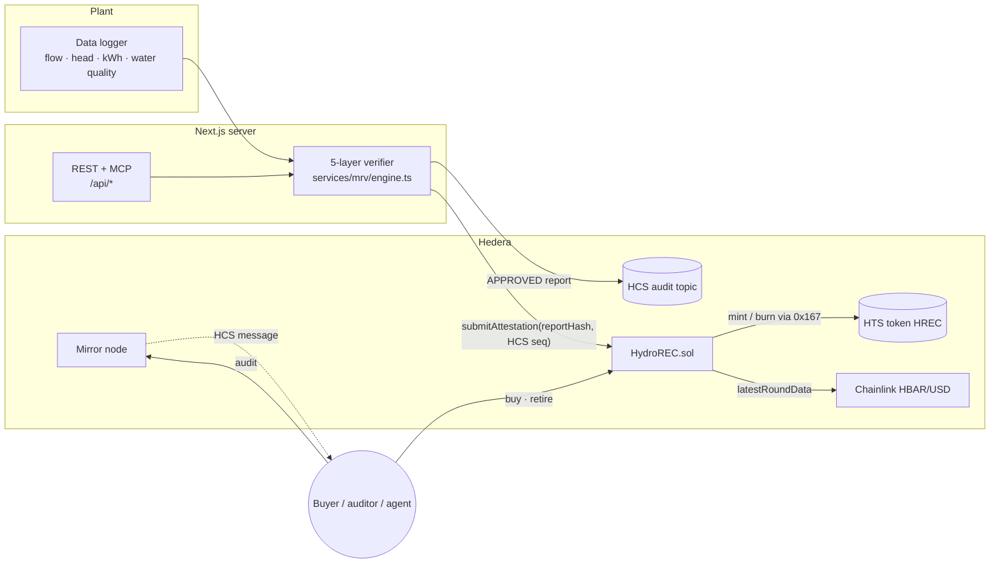

# Hydro dMRV — a Scaffold-HBAR template

**Verified hydropower renewable energy certificates on Hedera.** Metered telemetry from a run-of-river plant is
checked by a deterministic 5-layer verifier, the report is anchored on the **Hedera Consensus Service**, a Solidity
registry mints **Hedera Token Service** RECs, and a **Chainlink HBAR/USD** feed settles USD-priced sales in HBAR.
Every capability is also exposed over **MCP** so AI agents can verify, audit and trade without scraping the UI.

```bash
npm create scaffold-hbar@latest --template BikramBiswas786/Hedera-hydropower-dMRV-with-5-layer-verification-
```

| | |
| --- | --- |
| Hedera services | HCS (audit trail) · HTS (REC token created and minted by a contract) · Smart contracts |
| Ecosystem integration | Chainlink Data Feeds, HBAR/USD on Hedera testnet and mainnet |
| Stack | Next.js 15 · Hardhat · Yarn workspaces · Node ≥ 20.18.3 |
| Agent surface | MCP server at `/api/mcp`, JSON API under `/api`, [`/llms.txt`](packages/nextjs/public/llms.txt), [`AGENTS.md`](AGENTS.md) |

---

## Contents

1. [Why this template exists](#why-this-template-exists)
2. [Architecture](#architecture)
3. [Quick start](#quick-start)
4. [Environment variables](#environment-variables)
5. [Walkthrough](#walkthrough)
6. [The verification engine](#the-verification-engine)
7. [The HydroREC contract](#the-hydrorec-contract)
8. [Chainlink integration](#chainlink-integration)
9. [For AI agents](#for-ai-agents)
10. [Testing](#testing)
11. [Project structure](#project-structure)
12. [Extending the template](#extending-the-template)
13. [Security model and limitations](#security-model-and-limitations)

---

## Why this template exists

Small hydropower plants sell renewable energy certificates (RECs) and carbon credits, but the evidence behind them
is usually a spreadsheet checked once a year. Buyers cannot see the generation data, double counting is hard to rule
out, and payment is manual. Building a trustworthy pipeline needs four hard pieces at once, and this template wires
them together so you start from a working system instead of a blank page:

- **Verification you can re-run.** A pure, deterministic engine that anyone can execute on the same readings.
- **Tamper-evident evidence.** Reports are ordered and timestamped by HCS; the contract stores their SHA-256.
- **Rules the issuer cannot bypass.** The contract enforces the plant's nameplate capacity, rejects overlapping
  periods and requires a minimum trust score before it mints a single token.
- **Settlement in real prices.** Sellers think in USD per MWh, buyers pay HBAR. That conversion has to happen
  on-chain at an oracle price, or the seller is exposed to HBAR volatility between listing and sale.

## Architecture



The sequence for one day of generation:

1. The verifier scores 24 hourly readings (`verifyReadings`). Anything but **APPROVED** stops here.
2. The report, a compact JSON message under 1024 bytes, is published to the HCS topic. `reportHash` is
   `sha256(message)` and the message itself contains `dataHash = sha256(readings)`.
3. `HydroREC.submitAttestation` is simulated first, so a rejection costs nothing, then sent with the HCS topic and
   sequence number. The contract mints `energyWh / 1000` HTS units (kWh) into the plant operator's custody balance.
4. The operator lists RECs at a USD price. A buyer calls `buy` or `buyAndRetire`; the contract reads Chainlink,
   converts to HBAR, escrows the seller's proceeds and refunds any overpayment. Retiring burns the tokens on HTS.
5. Anyone runs **Audit**: fetch the HCS message from the mirror node, hash it, and compare hash, plant, period,
   energy and trust score with the on-chain record.

### Why each integration is load-bearing

| Piece | Remove it and… |
| --- | --- |
| **HCS** | Reports become mutable server data. The on-chain `reportHash` would point at nothing verifiable. |
| **HTS via the contract** | RECs would be ledger entries in a contract with no wallet, explorer or ecosystem support. Because the contract is the token's treasury and supply key, no one can mint outside the verification rules. |
| **Chainlink HBAR/USD** | USD-denominated settlement is impossible on-chain. Sellers would reprice by hand or carry HBAR risk. |

## Quick start

### Prerequisites

- Node.js **≥ 20.18.3** and Git
- Yarn via Corepack: `corepack enable`
- For testnet: a Hedera testnet account with an **ECDSA** key, funded from the
  [Hedera Portal faucet](https://portal.hedera.com/faucet). ECDSA matters: the same key signs HCS messages and,
  through its EVM alias, holds the contract's verifier role.

### 1. Scaffold and install

```bash
npm create scaffold-hbar@latest --template BikramBiswas786/Hedera-hydropower-dMRV-with-5-layer-verification-
cd <your-project>
yarn install
```

Working from a clone instead? `git clone`, then `yarn install`.

### 2. Run everything locally (no Hedera account, no internet)

```bash
yarn chain:offline                     # terminal 1: Hardhat node on :8545
yarn deploy --network localhost        # terminal 2: HydroREC + mock Chainlink feed + HTS mock + demo plant
```

Open `packages/nextjs/scaffold.config.ts` and move `hederaLocalFork` to the front of `targetNetworks`, then:

```bash
yarn start                             # http://localhost:3000
```

On a local chain there is no HCS, so the deploy step installs a faithful HTS mock at `0x167`
(`contracts/mocks/MockHederaTokenService.sol`) and a settable `MockV3Aggregator` priced at $0.25/HBAR. To mint
locally, create `packages/nextjs/.env.local` with `MRV_API_KEY=local-dev-key` and set `VERIFIER_PRIVATE_KEY` to the
private key of **Account #0**, which `yarn chain:offline` prints when it starts. That well-known test account
deployed the contracts, so it already holds the verifier role.

Then publish from **Verify** with the key `local-dev-key`, or run `yarn mrv:attest`. The burner wallet in the header
lets you buy and retire on the **Market** page immediately.

Prefer real HTS semantics locally? `yarn chain` starts a Hedera-forked node through
[`@hashgraph/system-contracts-forking`](https://github.com/hashgraph/hedera-forking), which emulates HTS against
testnet state. It needs internet access.

### 3. Deploy to Hedera testnet

```bash
yarn hardhat:account:import            # paste the ECDSA private key; it is stored encrypted in packages/hardhat/.env
yarn deploy --network hederaTestnet
```

The deploy prints Hashscan links for every transaction: contract creation, **HTS token creation from the contract**
(it sends 20 HBAR for the creation fee; set `REC_TOKEN_CREATE_FEE_HBAR` to change it), and the demo plant
registration. It also regenerates `packages/nextjs/contracts/deployedContracts.ts`. Commit that file so everyone
who scaffolds your fork gets a working read-only app on testnet.

Then enable publishing. In `packages/nextjs/.env.local`:

```bash
HEDERA_OPERATOR_ID=0.0.xxxxxxx
HEDERA_OPERATOR_KEY=0x...          # the same ECDSA key as the deployer, or grant VERIFIER_ROLE to another one
MRV_API_KEY=<a long random string>
```

```bash
yarn mrv:create-topic              # prints HCS_TOPIC_ID=0.0.… → add it to .env.local
yarn mrv:attest                    # verify 24 h of sample telemetry, anchor on HCS, mint RECs
```

`mrv:attest` prints the Hashscan links for the HCS message and the contract call. Open `/audit` and click
**Audit** on the new row to watch your browser prove the two match.

## Environment variables

Nothing is required to browse the app or use the verifier. Copy the `.env.example` next to each package.

`packages/nextjs/.env.local`

| Variable | Required for | Notes |
| --- | --- | --- |
| `HEDERA_OPERATOR_ID` | publishing | Account that signs and pays for HCS messages. |
| `HEDERA_OPERATOR_KEY` | publishing | Hex or DER. If ECDSA it is also the verifier's EVM key. |
| `HCS_TOPIC_ID` | publishing | Created by `yarn mrv:create-topic`; the operator key is its submit key. |
| `MRV_API_KEY` | publishing | Bearer token for `POST /api/mrv/attest` and the MCP `submit_attestation` tool. Unset disables writes. |
| `VERIFIER_PRIVATE_KEY` | optional | Overrides the verifier EVM key (ED25519 operators, local chains). |
| `NEXT_PUBLIC_HEDERA_TESTNET_RPC_URL` / `…MAINNET…` | optional | JSON-RPC relay; defaults to Hashio. |
| `NEXT_PUBLIC_MIRROR_NODE_URL` | optional | Defaults to the public mirror node of the first target network. |
| `NEXT_PUBLIC_WALLET_CONNECT_PROJECT_ID` | optional | Your WalletConnect project id for production. |

`packages/hardhat/.env`

| Variable | Notes |
| --- | --- |
| `DEPLOYER_PRIVATE_KEY_ENCRYPTED` | Written by `yarn hardhat:account:import` / `:generate`. |
| `VERIFIER_ADDRESS` | Extra address to grant `VERIFIER_ROLE` (the deployer always has it). |
| `PLANT_OPERATOR_ADDRESS` | Receives the demo plant's RECs; defaults to the deployer. |
| `REC_TOKEN_CREATE_FEE_HBAR` | HBAR sent with `createRecToken` (default 20). Unused change can be swept. |
| `MAX_PRICE_AGE_SECONDS` | Oracle staleness bound for settlement (default 90000 = 25 h). |

## Walkthrough

| Page | What you can do |
| --- | --- |
| **Home** `/` | See the flow, live registry totals, and how to connect an agent over MCP. |
| **Verify** `/verify` | Pick a scenario (`healthy`, `inflated`, `replay`, `spikes`, `polluted`) or paste your own readings. The report updates as you type, shows each layer's score and every failing interval, and previews the exact HCS message and `reportHash`. Operators can publish with the API key. |
| **Market** `/market` | See the Chainlink HBAR/USD price and its age, your custody balance and proceeds; list RECs in USD/MWh; buy, or buy and retire in one transaction; associate the HTS token (HIP-719) and withdraw to your wallet. |
| **Audit** `/audit` | Every attestation with its HCS link. **Audit** re-derives the evidence in your browser from the mirror node. Retirements are listed with their beneficiary. |
| **Debug** `/debug` | Scaffold-HBAR's contract console for every `HydroREC` function. |

## The verification engine

`packages/nextjs/services/mrv/engine.ts` is pure TypeScript with no I/O, so the same code runs in the browser, the
API, the MCP server and the tests. Each layer scores every interval between 0 and 1, and the layer score is the mean.

| Layer | Weight | Checks |
| --- | --- | --- |
| Physics | 30% | Metered energy vs hydraulic energy `E = ρ·g·Q·H·η·t`. Within 5% scores 1.0; beyond 30% scores 0. |
| Temporal | 25% | Contiguous timestamps (no duplicates, reordering or gaps) and plausible hour-to-hour changes in energy, flow and head. |
| Environmental | 20% | pH, turbidity and temperature inside river-plausible bands. Implausible water points to faulty or fabricated sensors. |
| Statistical | 15% | Modified z-score (median/MAD) of each interval's metered/hydraulic ratio. A few bad points cannot skew it. |
| Device | 10% | Energy ≤ nameplate capacity × interval, flow and head within design limits, declared efficiency within range. |

Decision rules:

- **APPROVED**: trust ≥ 0.90 **and** no interval failed a check. A high average cannot launder a few inflated hours.
- **FLAGGED**: trust ≥ 0.50, or high trust with failing intervals. Needs manual review; never minted automatically.
- **REJECTED**: trust < 0.50, or an integrity failure: replayed or reordered timestamps, energy above nameplate
  capacity, or more than 20% of intervals exceeding what the water can physically produce.

The report also estimates avoided emissions with ACM0002 for run-of-river (`ER = EG × EF_grid`, default grid factor
0.82 tCO₂/MWh). It is informational; carbon credit issuance is out of scope.

Sample scenarios and their outcomes (`services/mrv/scenarios.ts`, covered by tests):

| Scenario | What it simulates | Outcome |
| --- | --- | --- |
| `healthy` | 24 h of normal operation with sensor noise | APPROVED, 100% |
| `inflated` | Meter reports 35% more energy than the river can produce | REJECTED |
| `replay` | Four hours re-submitted with duplicate timestamps | REJECTED |
| `spikes` | Three isolated 22% spikes | FLAGGED, 96% |
| `polluted` | Acidic, very turbid water readings | FLAGGED, 82% |

## The HydroREC contract

`packages/hardhat/contracts/HydroREC.sol` (OpenZeppelin `AccessControl` + `ReentrancyGuard`).

**Units.** 1 HREC token = 1 MWh. The token has 3 decimals, so one base unit is 1 kWh. Attestations carry `energyWh`;
sub-kWh remainders carry over to the plant's next attestation so nothing is lost to rounding.

**Registry custody.** Minted RECs stay in the contract, which is the HTS treasury, and are tracked per account, like
I-REC and Verra registry accounts. Buyers therefore never need an HTS token association to buy or retire. Only
`withdraw` moves tokens to a wallet, and that wallet must be associated first (HIP-719 `associate()` on the token
address; the Market page has a button).

| Function | Who | What it enforces |
| --- | --- | --- |
| `createRecToken(name, symbol)` payable | admin | Creates the HTS token via `0x167`; the contract is treasury, admin and supply key. Once only. |
| `registerPlant(id, name, operator, capacityKw)` | admin | Unique id, non-zero capacity and operator. |
| `submitAttestation(input)` | `VERIFIER_ROLE` | Plant active; `periodEnd ≤ now`; `periodStart ≥ lastPeriodEnd` (no double counting); `energyWh ≤ capacityKw × duration`; trust ≥ `minTrustScoreBps`; non-empty `reportHash`. Mints into the operator's custody. |
| `createListing(units, usdCentsPerMwh)` / `cancelListing(id)` | holder | Moves units between custody and escrow. |
| `quote(listingId, units)` | view | Native cost at the Chainlink price, rounded up in the seller's favour. |
| `buy` / `buyAndRetire` payable | anyone | Rejects stale or invalid oracle answers and underpayment; escrows proceeds (pull payment); refunds excess. |
| `retire(units, beneficiary)` | holder | Burns on HTS and stores a permanent retirement record. |
| `withdraw(units)` · `withdrawProceeds()` | holder / seller | Token transfer via HTS · HBAR proceeds. |
| `sweepHbar(to)` | admin | Recovers stray HBAR (for example, change from the token-creation fee) but never seller proceeds. |

**HBAR decimals.** Inside the EVM on Hedera, `msg.value` is in tinybar (10⁸ per HBAR), while JSON-RPC `value` is
18-decimal weibar. The contract takes `NATIVE_UNITS_PER_HBAR` as a constructor argument (10⁸ on Hedera, 10¹⁸ on a
local Hardhat EVM), so quotes are always in the unit `msg.value` uses. The UI scales quotes to weibar with
`quoteToTxValue` (`app/market/_components/pricing.ts`).

**HTS response codes.** HTS returns a response code instead of reverting. `contracts/lib/HederaTokenLib.sol`
converts every non-`SUCCESS` (22) code into `HtsCallFailed(selector, code)`, so failures can never pass silently.

## Chainlink integration

Feeds are configured per network in `packages/hardhat/utils/hydroNetworkConfig.ts`:

| Network | HBAR/USD feed |
| --- | --- |
| Hedera testnet (296) | `0x59bC155EB6c6C415fE43255aF66EcF0523c92B4a` |
| Hedera mainnet (295) | `0xAF685FB45C12b92b5054ccb9313e135525F9b5d5` |
| Local | `MockV3Aggregator` (8 decimals, $0.25) |

Settlement price for `units` kWh listed at `p` US cents per MWh, with feed answer `a` at `d` decimals:

```
native = ceil( p · units · 10^d · NATIVE_UNITS_PER_HBAR / (100 · 1000 · a) )
```

`_freshHbarUsd` rejects non-positive answers, incomplete rounds and answers older than `maxPriceAge` (set per
network, adjustable by the admin with `setMaxPriceAge`). The Market page shows the answer's age and warns when
purchases are paused. `hbarUsdPrice()` returns the raw answer for display without the staleness check.

The contract only depends on the `AggregatorV3Interface`, so any adapter that exposes it works. To use Pyth or Supra,
deploy an adapter (see Scaffold-HBAR's `oracles` template) and pass its address to the constructor.

## For AI agents

Agents get the same capabilities as people, without a browser.

**MCP** at `/api/mcp` (streamable HTTP, stateless; `@modelcontextprotocol/server` v2, serving both current and
2025-era clients):

```bash
claude mcp add --transport http hydro-dmrv http://localhost:3000/api/mcp
```

| Tool | Access | Purpose |
| --- | --- | --- |
| `list_scenarios` | public | Scenario catalogue and the demo plant profile |
| `generate_sample_telemetry` | public | Deterministic readings for any scenario |
| `verify_telemetry` | public | Full report, HCS message and `reportHash`; writes nothing |
| `get_registry_overview` | public | Totals, plants, token, Chainlink price |
| `list_attestations` | public | Paginated attestations with HCS anchors |
| `audit_attestation` | public | Mirror-node proof that an attestation matches its report |
| `list_open_listings` | public | Listings with HBAR quotes |
| `submit_attestation` | bearer `MRV_API_KEY` | Verify → HCS → mint. Only listed for authenticated requests |

Resource `hydro-dmrv://methodology` gives agents the verification rules. The same operations are available as REST
endpoints, listed in [`/llms.txt`](packages/nextjs/public/llms.txt). For coding agents working *on* the template,
[`AGENTS.md`](AGENTS.md) has the conventions and invariants.

## Testing

```bash
yarn test              # contracts + frontend unit tests
yarn hardhat:test      # 23 contract tests, hermetic (HTS mock installed at 0x167)
yarn hardhat:test:fork # same suite against Hedera's HTS emulation (HEDERA_FORKING, needs internet)
yarn hardhat:test:gas  # with a gas report
yarn next:test         # 27 vitest tests: engine, HCS report, audit, pricing
yarn lint && yarn next:build
```

What the tests pin down:

- **Contracts**: HTS token creation, mint and burn; HTS failure codes surfacing as reverts; the association
  requirement; the capacity ceiling; period overlap; trust threshold; sub-kWh carry; oracle-priced quotes that
  track the feed; stale and invalid price rejection; refunds; pull-payment proceeds; sweep never touching seller
  funds; and the invariant *treasury balance = custody + listed units*.
- **Engine**: every scenario's decision, capacity hard failure, determinism, the physics formula, HCS messages
  fitting a single chunk, and hash equality between local and mirror-node payloads.
- **Audit**: a report that matches, an attestation claiming more energy than its report, a report altered after
  anchoring, a missing anchor and a mirror-node outage.

The template also ships a [Hedera Harness](https://github.com/hedera-dev/hedera-harness) recipe in `.harness/`:
static and command validators, a Playwright smoke gate for every route, a Tier 3 acceptance contract, and an opt-in
Tier 3.5 testnet deployment. `hedera-harness` and `playwright` are dev dependencies, so after a one-time
`npx playwright install chromium` you can run `yarn harness:validate` (Tiers 0–2, no credentials) or
`yarn harness:run` to have an agent build a feature against these validators.

## Project structure

```
packages/
├── hardhat/
│   ├── contracts/
│   │   ├── HydroREC.sol                 registry, attestation, marketplace, retirement
│   │   ├── lib/HederaTokenLib.sol       HTS create/mint/burn/transfer with response-code checks
│   │   ├── interfaces/                  IHederaTokenService subset, Chainlink AggregatorV3Interface
│   │   └── mocks/                       MockHederaTokenService (0x167), MockV3Aggregator
│   ├── deploy/                          00 deploy · 01 idempotent setup (token, roles, demo plant)
│   ├── utils/hydroNetworkConfig.ts      feeds, HBAR units, staleness, Hashscan links per network
│   └── test/HydroREC.test.ts
└── nextjs/
    ├── app/
    │   ├── verify/ market/ audit/       pages (server components + client components in _components/)
    │   └── api/                         mrv/* · registry/* · mcp
    ├── services/mrv/
    │   ├── engine.ts  schema.ts  scenarios.ts   pure verification core
    │   ├── report.ts  audit.ts  views.ts        HCS message, mirror-node audit, contract view models
    │   ├── network.ts                           chain, mirror node, Hashscan, deployment lookup
    │   └── server/                              HCS, registry reads, attestation pipeline, MCP, auth
    ├── scripts/mrv.ts                   yarn mrv:create-topic · yarn mrv:attest
    └── public/llms.txt
.harness/                                Hedera Harness spec, PRD, validators, acceptance contract
template.json                            create-scaffold-hbar manifest
```

## Extending the template

- **Your plant.** Register it with `registerPlant` (Debug page) and pass a matching `plant` profile to the API or
  MCP tools. The attestation pipeline refuses profiles whose capacity differs from the on-chain registration.
- **Real telemetry.** Post your logger's readings to `POST /api/mrv/attest` on a schedule. The schema is in
  `services/mrv/schema.ts`; readings are validated with zod at the boundary.
- **Stricter verification.** Tune `LAYER_WEIGHTS`, `DECISION_THRESHOLDS` or add a layer in `engine.ts`; keep it
  pure and add a scenario plus a test. Raise `minTrustScoreBps` on-chain to match.
- **Another oracle.** Anything exposing `AggregatorV3Interface`; see [Chainlink integration](#chainlink-integration).
- **Mainnet.** Put `chains.hedera` first in `scaffold.config.ts` and deploy with `--network hederaMainnet`.

## Security model and limitations

- **The verifier is trusted to run the engine honestly.** What it cannot do is hide its work: every report is on
  HCS, the engine is deterministic, `dataHash` commits to the raw readings, and the contract independently enforces
  capacity, continuity and trust thresholds. Production deployments should add device-signed telemetry and several
  verifiers.
- **Registry custody** means the contract holds RECs for accounts. The contract is not upgradeable and has no
  admin path to move anyone's balance.
- **Oracle risk** is bounded by the staleness check and the seller-favouring round-up. Tune `maxPriceAge` to the
  feed's heartbeat.
- **Write endpoints** are disabled unless `MRV_API_KEY` is set and use constant-time comparison. Put them behind
  your own authentication before exposing them publicly.
- **Not audited.** This is a starting point, not production-ready code.

## License and credits

MIT, see [LICENCE](LICENCE). Built on [Scaffold-HBAR](https://github.com/hedera-dev/scaffold-hbar) (MIT, BuidlGuidl
and hedera-dev). The verification layers originate from the author's
[Hedera hydropower MRV](https://github.com/BikramBiswas786/hedera-hydropower-mrv) research.
