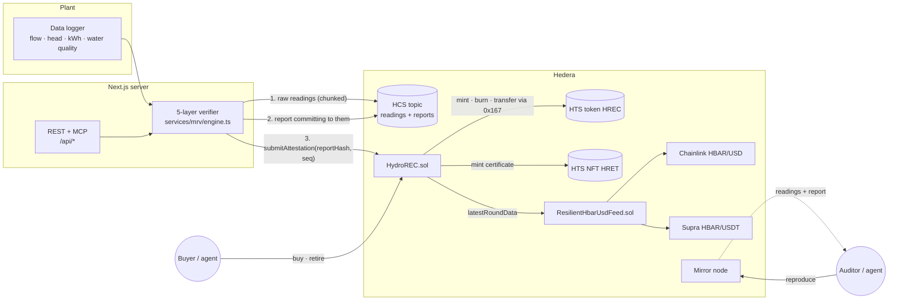

# Hydro dMRV — a Scaffold-HBAR template

**Verified hydropower renewable energy certificates on Hedera that anyone, human or AI agent, can check,
reproduce, trade and retire.** Metered telemetry from a run-of-river plant is scored by a deterministic 5-layer
verifier. The raw readings and the verdict are published on the **Hedera Consensus Service**, so anyone can re-run the
verification from public data. A Solidity registry mints **Hedera Token Service** RECs and, on retirement, burns them
and mints an **HTS NFT certificate**. Sales are priced in USD and settled in HBAR through **Chainlink HBAR/USD**,
cross-checked against a **Supra** fallback feed.

```bash
npm create scaffold-hbar@latest --template BikramBiswas786/Hedera-hydropower-dMRV-with-5-layer-verification-
```

| | |
| --- | --- |
| Hedera services | **HCS**: chunked raw-readings messages and verdict reports · **HTS**: fungible REC token and NFT certificate collection, both created, minted and burned by the contract · **Smart contracts**: registry and oracle aggregator |
| Ecosystem integration | **Chainlink** Data Feeds (primary) and **Supra** push oracle (fallback and cross-check), testnet and mainnet |
| Stack | Next.js 15 · Hardhat · Yarn workspaces · Node ≥ 20.18.3 |
| Agent surface | MCP server at `/api/mcp` (10 tools), JSON API under `/api`, [`/llms.txt`](packages/nextjs/public/llms.txt), [`AGENTS.md`](AGENTS.md), [Hedera Harness](#testing) recipe |

---

## Contents

1. [Why this template exists](#why-this-template-exists)
2. [Architecture](#architecture)
3. [Quick start](#quick-start)
4. [Environment variables](#environment-variables)
5. [Walkthrough](#walkthrough)
6. [The verification engine](#the-verification-engine)
7. [Public re-verification on HCS](#public-re-verification-on-hcs)
8. [The HydroREC contract](#the-hydrorec-contract)
9. [Oracle integration: Chainlink with a Supra fallback](#oracle-integration-chainlink-with-a-supra-fallback)
10. [For AI agents](#for-ai-agents)
11. [Testing](#testing)
12. [Project structure](#project-structure)
13. [Extending the template](#extending-the-template)
14. [Security model and limitations](#security-model-and-limitations)

---

## Why this template exists

Small hydropower plants sell renewable energy certificates (RECs) and carbon credits, but the evidence behind them
is usually a spreadsheet checked once a year. Buyers cannot see the data, double counting is hard to rule out, and
settlement is manual. A trustworthy pipeline needs several hard pieces at once. This template wires them together, so
you start from a working system instead of a blank page:

- **Verification anyone can reproduce.** The engine is pure and deterministic, and its inputs are public on HCS. So
  the question is no longer "do you trust the verifier?" but "run it yourself".
- **Rules the issuer cannot bypass.** The contract enforces nameplate capacity, rejects overlapping periods and
  requires a minimum trust score before it mints a single token. It holds the only supply key.
- **Settlement at a price you can defend.** Sellers think in USD per MWh, buyers pay HBAR. The conversion happens
  on-chain at an oracle price that two independent providers must agree on.
- **Proof of retirement that travels.** Every retirement burns the RECs and mints an NFT certificate: portable
  evidence for an ESG report, readable by any wallet or explorer.

## Architecture



The sequence for one day of generation:

1. The verifier scores 24 hourly readings (`verifyReadings`). Anything but **APPROVED** stops here.
2. `submitAttestation` is simulated first, so a rejection costs nothing.
3. The **raw readings and plant profile** go to the HCS topic as one message, split into up to 20 chunks.
4. The **report** (verdict, per-layer scores, energy, period) goes to the same topic. It commits to step 3's message
   by SHA-256 and sequence number. `reportHash = sha256(report)`.
5. `HydroREC.submitAttestation` records `reportHash` and the report's HCS sequence number, re-checks capacity,
   continuity and trust, and mints `energyWh / 1000` HTS units (kWh) into the plant operator's custody balance.
6. The operator lists RECs at a USD price. A buyer calls `buy` or `buyAndRetire`. The contract prices it through
   `ResilientHbarUsdFeed`, escrows the seller's proceeds and refunds overpayment. Retiring burns the RECs and mints a
   certificate NFT.
7. Anyone runs **Check evidence**. It fetches both messages from the mirror node, verifies both hashes, re-runs the
   engine and compares every figure with the chain.

### Why each integration is load-bearing

| Piece | Remove it and… |
| --- | --- |
| **HCS readings + report** | The verdict becomes an unverifiable claim. With both on HCS, a verifier who approves bad data is caught by anyone who re-runs the engine. |
| **HTS via the contract** | RECs would be ledger entries in a contract with no wallet, explorer or ecosystem support. Because the contract is treasury and supply key of both tokens, nothing can be minted outside the verification rules. |
| **Chainlink + Supra** | USD-denominated settlement is impossible on-chain. With one feed, a single outage halts the market and a single bad answer misprices it. Two providers that must agree remove both failure modes. |

## Quick start

### Prerequisites

- Node.js **≥ 20.18.3** and Git
- Yarn via Corepack: `corepack enable`
- For testnet: a Hedera testnet account with an **ECDSA** key, funded from the
  [Hedera Portal faucet](https://portal.hedera.com/faucet) with at least 60 HBAR. ECDSA matters: the same key signs
  HCS messages and, through its EVM alias, holds the contract's verifier role.

### 1. Scaffold and install

```bash
npm create scaffold-hbar@latest --template BikramBiswas786/Hedera-hydropower-dMRV-with-5-layer-verification-
cd <your-project>
yarn install
```

Working from a clone instead? `git clone`, then `yarn install`.

### 2. Run everything locally (no Hedera account, no internet)

```bash
yarn chain:offline                     # terminal 1: Hardhat node on :8545
yarn deploy --network localhost        # terminal 2: mocks for HTS, Chainlink and Supra, then the real contracts
```

Open `packages/nextjs/scaffold.config.ts` and move `hederaLocalFork` to the front of `targetNetworks`, then:

```bash
yarn start                             # http://localhost:3000
```

On a local chain there is no HCS, so the deploy installs a faithful HTS mock at `0x167`
(`contracts/mocks/MockHederaTokenService.sol`, covering fungible tokens, NFTs and association). It also deploys
settable Chainlink and Supra mocks priced near $0.25/HBAR. To mint locally, create `packages/nextjs/.env.local` with
`MRV_API_KEY=local-dev-key`, and set `VERIFIER_PRIVATE_KEY` to the private key of **Account #0**, which
`yarn chain:offline` prints when it starts. That well-known test account deployed the contracts, so it already holds
the verifier role. Then publish from **Verify** with the key `local-dev-key`, or run `yarn mrv:attest`. The burner
wallet in the header lets you buy, retire and claim certificates immediately.

Prefer real HTS semantics locally? `yarn chain` starts a Hedera-forked node through
[`@hashgraph/system-contracts-forking`](https://github.com/hashgraph/hedera-forking), which emulates HTS against
testnet state. It needs internet access.

### 3. Deploy to Hedera testnet

```bash
yarn hardhat:account:import            # paste the ECDSA private key; stored encrypted in packages/hardhat/.env
yarn deploy --network hederaTestnet
```

The deploy prints a Hashscan link for every transaction:

- `ResilientHbarUsdFeed` wired to the live Chainlink and Supra feeds
- `HydroREC`
- the **HTS REC token** and the **HTS NFT certificate collection**, both created by the contract (20 HBAR each for the
  creation fee; set `REC_TOKEN_CREATE_FEE_HBAR` / `CERTIFICATE_TOKEN_CREATE_FEE_HBAR` to change it)
- the demo plant registration

It also regenerates `packages/nextjs/contracts/deployedContracts.ts`. Commit that file, so everyone who scaffolds
your fork gets a working read-only app on testnet.

Then enable publishing. In `packages/nextjs/.env.local`:

```bash
HEDERA_OPERATOR_ID=0.0.xxxxxxx
HEDERA_OPERATOR_KEY=0x...          # the same ECDSA key as the deployer, or grant VERIFIER_ROLE to another one
MRV_API_KEY=<a long random string>
```

```bash
yarn mrv:create-topic              # prints HCS_TOPIC_ID=0.0.… → add it to .env.local
yarn mrv:attest                    # verify 24 h of sample telemetry, publish readings + report, mint RECs
```

`mrv:attest` prints Hashscan links for both HCS messages and the contract call. Open `/audit` and click
**Check evidence** on the new row to watch your browser reproduce the verdict from public data.

## Environment variables

Nothing is required to browse the app or use the verifier. Copy the `.env.example` next to each package.

`packages/nextjs/.env.local`

| Variable | Required for | Notes |
| --- | --- | --- |
| `HEDERA_OPERATOR_ID` | publishing | Account that signs and pays for HCS messages. |
| `HEDERA_OPERATOR_KEY` | publishing | Hex or DER. If ECDSA, it is also the verifier's EVM key. |
| `HCS_TOPIC_ID` | publishing | Created by `yarn mrv:create-topic`; the operator key is its submit key. |
| `MRV_API_KEY` | publishing | Bearer token for `POST /api/mrv/attest` and the MCP `submit_attestation` tool. Unset disables writes. |
| `VERIFIER_PRIVATE_KEY` | optional | Overrides the verifier EVM key (ED25519 operators, local chains). |
| `NEXT_PUBLIC_HEDERA_TESTNET_RPC_URL` / `…MAINNET…` | optional | JSON-RPC relay; defaults to Hashio. |
| `NEXT_PUBLIC_MIRROR_NODE_URL` | optional | Defaults to the public mirror node of the first target network. |
| `NEXT_PUBLIC_WALLET_CONNECT_PROJECT_ID` | optional | Your WalletConnect project id for production. |

`packages/hardhat/.env`

| Variable | Notes |
| --- | --- |
| `DEPLOYER_PRIVATE_KEY_ENCRYPTED` | Written by `yarn hardhat:account:import` / `:generate`. |
| `VERIFIER_ADDRESS` | Extra address to grant `VERIFIER_ROLE` (the deployer always has it). |
| `PLANT_OPERATOR_ADDRESS` | Receives the demo plant's RECs; defaults to the deployer. |
| `REC_TOKEN_CREATE_FEE_HBAR` · `CERTIFICATE_TOKEN_CREATE_FEE_HBAR` | HBAR sent to cover each HTS creation fee (default 20). Unused change can be swept. |
| `MAX_PRICE_AGE_SECONDS` | Oracle staleness bound for each source and for settlement (default 90000 = 25 h). |
| `MAX_ORACLE_DEVIATION_BPS` | How far fresh Chainlink and Supra answers may disagree (default 300 = 3%). |

## Walkthrough

| Page | What you can do |
| --- | --- |
| **Home** `/` | See the flow, live registry totals, and how to connect an agent over MCP. |
| **Verify** `/verify` | Pick a scenario (`healthy`, `inflated`, `replay`, `spikes`, `polluted`) or paste your own readings. The report updates as you type and shows each layer's score and every failing interval. It previews the exact HCS report, the data hash and how many HCS chunks the readings need. Operators can publish with the API key. |
| **Market** `/market` | Both oracle sources, which one is pricing, and whether purchases are paused. Your custody balance and proceeds; list RECs in USD/MWh; buy, or buy and retire in one transaction; associate the HTS token (HIP-719) and withdraw to your wallet. |
| **Audit** `/audit` | Every attestation with its HCS link. **Check evidence** runs the full reproduction in your browser. Retirements link to their certificates. |
| **Certificate** `/certificate/{id}` | A printable retirement certificate backed by on-chain data, with its NFT serial and Hashscan link. If the NFT could not be delivered at retirement, associate and claim it here. |
| **Debug** `/debug` | Scaffold-HBAR's contract console for every function of `HydroREC` and `ResilientHbarUsdFeed`. |

## The verification engine

`packages/nextjs/services/mrv/engine.ts` is pure TypeScript with no I/O, so the same code runs in the browser, the
API, the MCP server, the audit and the tests. Each layer scores every interval between 0 and 1; the layer score is
the mean.

| Layer | Weight | Checks |
| --- | --- | --- |
| Physics | 30% | Metered energy vs hydraulic energy `E = ρ·g·Q·H·η·t`. Within 5% scores 1.0; beyond 30% scores 0. |
| Temporal | 25% | Contiguous timestamps (no duplicates, reordering or gaps) and plausible hour-to-hour changes in energy, flow and head. |
| Environmental | 20% | pH, turbidity and temperature inside river-plausible bands. Implausible water points to faulty or fabricated sensors. |
| Statistical | 15% | Modified z-score (median/MAD) of each interval's metered/hydraulic ratio. A few bad points cannot skew it. |
| Device | 10% | Energy ≤ nameplate capacity × interval, flow and head within design limits, declared efficiency within range. |

Decision rules:

- **APPROVED**: trust ≥ 0.90 **and** no interval failed a check. A high average cannot launder a few inflated hours.
- **FLAGGED**: trust ≥ 0.50, or high trust with failing intervals. Needs manual review; never minted automatically.
- **REJECTED**: trust < 0.50, or an integrity failure: replayed or reordered timestamps, energy above nameplate
  capacity, or more than 20% of intervals exceeding what the water can physically produce.

The report also estimates avoided emissions with ACM0002 for run-of-river (`ER = EG × EF_grid`, default grid factor
0.82 tCO₂/MWh). It is informational; carbon credit issuance is out of scope.

| Scenario | What it simulates | Outcome |
| --- | --- | --- |
| `healthy` | 24 h of normal operation with sensor noise | APPROVED, 100% |
| `inflated` | Meter reports 35% more energy than the river can produce | REJECTED |
| `replay` | Four hours re-submitted with duplicate timestamps | REJECTED |
| `spikes` | Three isolated 22% spikes | FLAGGED, 96% |
| `polluted` | Acidic, very turbid water readings | FLAGGED, 82% |

## Public re-verification on HCS

Two message types go to the audit topic (`services/mrv/report.ts`):

| Message | Schema | Contents | Size |
| --- | --- | --- | --- |
| Data | `hydro-dmrv/readings@1` | Every reading, the plant profile, grid factor and engine version | 3 chunks for a day, 13 for a week; HCS caps a message at 20 (about ten days of hourly data) |
| Report | `hydro-dmrv/report@2` | Decision, trust, per-layer scores, energy, period, and `data: { hash, sequence }` | 1 chunk |

`reproduceAttestation` (`services/mrv/audit.ts`) runs these checks:

1. **Report vs chain.** Fetch the report at the attestation's sequence number, check `sha256(report) == reportHash`,
   and compare plant, period, energy, trust and decision field by field. This catches a verifier who anchors one
   report and attests different numbers.
2. **Data vs report.** Reassemble the chunked data message (chunks are matched by their initial transaction id and
   ordered by chunk number, so interleaved messages cannot corrupt it) and check its hash against `report.data.hash`.
3. **Verdict vs data.** Re-run the engine and compare decision, trust score, energy, period, reading count and every
   layer score with the report. This catches a verifier who publishes honest data but approves it anyway.

The same function backs the Audit page, `GET /api/registry/attestations/{id}/reproduce` and the
`reproduce_attestation` MCP tool, and needs no credentials. The tests include a forged verdict over published
readings and a data message swapped after anchoring.

## The HydroREC contract

`packages/hardhat/contracts/HydroREC.sol` (OpenZeppelin `AccessControl` + `ReentrancyGuard`).

**Units.** 1 HREC token = 1 MWh. The token has 3 decimals, so one base unit is 1 kWh. Attestations carry `energyWh`;
sub-kWh remainders carry over to the plant's next attestation, so nothing is lost to rounding.

**Registry custody.** Minted RECs stay in the contract, which is the HTS treasury, and are tracked per account, like
I-REC and Verra registry accounts. Buyers therefore never need an HTS association to buy or retire. Only `withdraw`
moves tokens to a wallet, and that wallet must be associated first (HIP-719 `associate()` on the token address).

**Retirement certificates.** `createCertificateToken` creates an HTS NFT collection owned by the contract. Every
retirement burns the RECs, then mints one NFT with metadata `hydro-dmrv:retirement:<id>` and tries to transfer it to
the retiring account. HTS reports failure as a response code, so if the wallet is not associated and has no free
auto-association slot, the retirement still succeeds. The NFT waits in the treasury until the owner calls
`claimCertificate`.

| Function | Who | What it enforces |
| --- | --- | --- |
| `createRecToken` · `createCertificateToken` (payable) | admin | Creates the HTS token / NFT collection through `0x167`; the contract is treasury, admin and supply key. Once each. |
| `registerPlant(id, name, operator, capacityKw)` | admin | Unique id, non-zero capacity and operator. |
| `submitAttestation(input)` | `VERIFIER_ROLE` | Plant active; `periodEnd ≤ now`; `periodStart ≥ lastPeriodEnd` (no double counting); `energyWh ≤ capacityKw × duration`; trust ≥ `minTrustScoreBps`; non-empty `reportHash`. Mints into the operator's custody. |
| `createListing(units, usdCentsPerMwh)` · `cancelListing(id)` | holder | Moves units between custody and escrow. |
| `quote(listingId, units)` | view | Native cost at the oracle price, rounded up in the seller's favour. |
| `buy` · `buyAndRetire` (payable) | anyone | Rejects stale or invalid prices and underpayment; escrows proceeds (pull payment); refunds excess. |
| `retire(units, beneficiary)` | holder | Burns on HTS, stores a permanent record, issues the certificate NFT. |
| `claimCertificate(retirementId)` | retiring account | Delivers a certificate NFT that could not be sent at retirement time. |
| `withdraw(units)` · `withdrawProceeds()` | holder / seller | HTS token transfer · HBAR proceeds. |
| `sweepHbar(to)` | admin | Recovers stray HBAR (for example, token-creation change) but never seller proceeds. |

**HBAR decimals.** Inside the EVM on Hedera, `msg.value` is in tinybar (10⁸ per HBAR), while JSON-RPC `value` is
18-decimal weibar. The contract takes `NATIVE_UNITS_PER_HBAR` as a constructor argument (10⁸ on Hedera, 10¹⁸ on a
local Hardhat EVM), so quotes are always in the unit `msg.value` uses. The UI and `prepare_purchase` scale quotes to
weibar with `quoteToTxValue` (`services/mrv/pricing.ts`).

**HTS response codes.** HTS returns a response code instead of reverting. `contracts/lib/HederaTokenLib.sol` turns
every non-`SUCCESS` (22) code into `HtsCallFailed(selector, code)`, except the certificate delivery, which is
deliberately best-effort.

## Oracle integration: Chainlink with a Supra fallback

`HydroREC` reads prices through `AggregatorV3Interface`. The deployment points it at
`contracts/ResilientHbarUsdFeed.sol`, which implements that interface over two independent providers:

| Network | Chainlink HBAR/USD (primary) | Supra push oracle (fallback, pair 75 HBAR/USDT) |
| --- | --- | --- |
| Hedera testnet (296) | `0x59bC155EB6c6C415fE43255aF66EcF0523c92B4a` | `0x6Cd59830AAD978446e6cc7f6cc173aF7656Fb917` |
| Hedera mainnet (295) | `0xAF685FB45C12b92b5054ccb9313e135525F9b5d5` | `0xD02cc7a670047b6b012556A88e275c685d25e0c9` |
| Local | `MockV3Aggregator` ($0.25) | `MockSupraSValueFeed` ($0.2505) |

Rules, applied on every read:

| Chainlink | Supra | Result |
| --- | --- | --- |
| fresh | fresh | Must agree within `MAX_DEVIATION_BPS` (3%), otherwise **revert** `PriceSourcesDisagree`. Chainlink's answer is used. |
| fresh | stale / unavailable | Chainlink alone |
| stale / invalid | fresh | Supra alone (the market survives a Chainlink outage) |
| stale | stale | **revert** `NoFreshPrice` |

Both answers are normalised to 8 decimals. Supra's millisecond timestamps and 18-decimal prices are handled, and a
reverting provider counts as unavailable instead of bubbling up. The 3% band also absorbs the small USDT/USD basis of
Supra's pair. `readSources()` never reverts, so dashboards and agents can always see both providers.

Settlement price for `units` kWh listed at `p` US cents per MWh, with feed answer `a` at `d` decimals:

```
native = ceil( p · units · 10^d · NATIVE_UNITS_PER_HBAR / (100 · 1000 · a) )
```

`HydroREC` applies its own `maxPriceAge` on top, adjustable by the admin with `setMaxPriceAge`. Any
`AggregatorV3Interface` works, so you can swap in Pyth through an adapter (see Scaffold-HBAR's `oracles` template).

## For AI agents

Agents get the same capabilities as people, without a browser, and act with their own wallets.

**MCP** at `/api/mcp` (streamable HTTP, stateless; `@modelcontextprotocol/server` v2, serving both current and
2025-era clients):

```bash
claude mcp add --transport http hydro-dmrv http://localhost:3000/api/mcp
```

| Tool | Access | Purpose |
| --- | --- | --- |
| `list_scenarios` · `generate_sample_telemetry` | public | Scenario catalogue, demo plant, deterministic readings |
| `verify_telemetry` | public | Full report, HCS report message, data hash and chunk count; writes nothing |
| `get_registry_overview` | public | Totals, plants, tokens, both oracle sources and the active one |
| `list_attestations` | public | Paginated attestations with HCS anchors |
| `audit_attestation` | public | Report vs chain |
| `reproduce_attestation` | public | Report vs chain, data vs report, engine re-run vs report |
| `list_open_listings` | public | Listings with HBAR quotes |
| `prepare_purchase` | public | Unsigned `buy` / `buyAndRetire` transaction (to, data, value) for the agent's own wallet |
| `get_retirement_certificate` | public | Retirement record and its NFT certificate |
| `submit_attestation` | bearer `MRV_API_KEY` | Verify → HCS → mint. Only listed for authenticated requests |

An autonomous buyer needs no special permissions:

```
list_open_listings → prepare_purchase { listingId, amountKwh, beneficiary } → sign & send with its own key
→ get_retirement_certificate
```

The server never sees the agent's key. The resource `hydro-dmrv://methodology` gives agents the verification rules.
Every tool has a REST twin, listed in [`/llms.txt`](packages/nextjs/public/llms.txt). For coding agents working *on*
the template, [`AGENTS.md`](AGENTS.md) has the conventions and invariants.

## Testing

```bash
yarn test              # contracts + frontend unit tests
yarn hardhat:test      # 38 contract tests, hermetic (HTS mock at 0x167, oracle mocks)
yarn hardhat:test:fork # same suite against Hedera's HTS emulation (HEDERA_FORKING, needs internet)
yarn hardhat:test:gas  # with a gas report
yarn next:test         # 38 vitest tests: engine, HCS messages, audit and reproduction, pricing
yarn lint && yarn next:build
```

What the tests pin down:

- **HydroREC**: HTS token and NFT creation, mint and burn; failure codes surfacing as reverts; the association
  requirement; certificate delivery, the pending-claim path and claim authorisation; capacity ceiling; period
  overlap; trust threshold; sub-kWh carry; oracle-priced quotes; stale and invalid price rejection; refunds;
  pull-payment proceeds; sweep never touching seller funds; and the invariant *treasury balance = custody + listed*.
- **ResilientHbarUsdFeed**: agreement, fallback on a stale or non-positive Chainlink answer, tolerance of a broken
  Supra, refusal on disagreement and on double staleness, Supra's decimals and millisecond timestamps, and a full
  purchase settled through the fallback during a Chainlink outage.
- **Engine and HCS**: every scenario's decision, determinism, the physics formula, message size limits, exact data
  round-trips and hash stability.
- **Audit and reproduction** (against a fake mirror node that chunks like HCS): matching evidence, inflated
  attestations, altered reports, interleaved chunks, a forged verdict over honest data, swapped data and missing data.

The template ships a [Hedera Harness](https://github.com/hedera-dev/hedera-harness) recipe in `.harness/`: static and
command validators, a Playwright smoke gate for every route, a Tier 3 acceptance contract, and an opt-in Tier 3.5
testnet deployment. `hedera-harness` and `playwright` are dev dependencies, so after a one-time
`npx playwright install chromium` you can run `yarn harness:validate` (Tiers 0–2, no credentials), or `yarn harness:run`
to have an agent build a feature against these validators. CI (`.github/workflows/ci.yaml`) runs every check on
Node 20.18.3 and scaffolds the template through the real `create-scaffold-hbar` CLI.

## Project structure

```
packages/
├── hardhat/
│   ├── contracts/
│   │   ├── HydroREC.sol                 registry, attestation, marketplace, retirement, NFT certificates
│   │   ├── ResilientHbarUsdFeed.sol     Chainlink + Supra aggregator behind AggregatorV3Interface
│   │   ├── lib/HederaTokenLib.sol       HTS create / mint / burn / transfer for tokens and NFTs
│   │   ├── interfaces/                  IHederaTokenService subset, Chainlink and Supra interfaces
│   │   └── mocks/                       HTS (tokens + NFTs + association), Chainlink, Supra
│   ├── deploy/                          00 oracles + contracts · 01 idempotent setup (tokens, roles, demo plant)
│   ├── utils/hydroNetworkConfig.ts      feeds, HBAR units, staleness, Hashscan links per network
│   └── test/                            HydroREC.test.ts · ResilientHbarUsdFeed.test.ts
└── nextjs/
    ├── app/
    │   ├── verify/ market/ audit/ certificate/[id]/   pages; client components in _components/
    │   └── api/                         mrv/* · registry/* · market/* · mcp
    ├── services/mrv/
    │   ├── engine.ts  schema.ts  scenarios.ts   pure verification core
    │   ├── report.ts  pipeline.ts               HCS data and report messages
    │   ├── mirror.ts  audit.ts                  mirror-node reads, audit and reproduction
    │   ├── pricing.ts  views.ts  network.ts     unit conversions, view models, chain and deployment lookup
    │   └── server/                              HCS publishing, registry reads, attestation, market, MCP, auth
    ├── scripts/mrv.ts                   yarn mrv:create-topic · yarn mrv:attest
    └── public/llms.txt
.harness/                                Hedera Harness spec, PRD, validators, acceptance contract
template.json                            create-scaffold-hbar manifest
```

## Extending the template

- **Your plant.** Register it with `registerPlant` (Debug page) and pass a matching `plant` profile to the API or
  MCP tools. The pipeline refuses profiles whose capacity differs from the on-chain registration.
- **Real telemetry.** Post your logger's readings to `POST /api/mrv/attest` on a schedule. The schema is in
  `services/mrv/schema.ts`; readings are validated with zod at the boundary. Keep batches under the 20-chunk limit
  (about ten days of hourly data).
- **Stricter verification.** Tune `LAYER_WEIGHTS`, `DECISION_THRESHOLDS` or add a layer in `engine.ts`; keep it pure,
  bump `ENGINE_VERSION`, and add a scenario plus a test. Reproduction flags reports made by other engine versions.
- **Another oracle.** Implement `AggregatorV3Interface`, or change the providers behind `ResilientHbarUsdFeed`.
- **Mainnet.** Put `chains.hedera` first in `scaffold.config.ts` and deploy with `--network hederaMainnet`.

## Security model and limitations

- **The verifier cannot hide its work.** Readings, verdict and hashes are public and the engine is deterministic,
  so a dishonest approval is detectable by anyone. The trust that remains is in the *telemetry source*. Production
  deployments should add device-signed readings and several verifiers.
- **Registry custody** means the contract holds RECs and undelivered certificates for accounts. The contract is not
  upgradeable and has no admin path to move anyone's balance.
- **Oracle risk** is bounded by two independent providers, a deviation guard, staleness checks and the
  seller-favouring round-up. Tune `MAX_PRICE_AGE_SECONDS` and `MAX_ORACLE_DEVIATION_BPS` to the feeds' heartbeats.
- **Write endpoints** are disabled unless `MRV_API_KEY` is set and use a constant-time comparison. Put them behind
  your own authentication before exposing them publicly. Purchases never touch the server: agents sign their own.
- **Not audited.** This is a starting point, not production-ready code.

## License and credits

MIT, see [LICENCE](LICENCE). Built on [Scaffold-HBAR](https://github.com/hedera-dev/scaffold-hbar) (MIT, BuidlGuidl
and hedera-dev). The verification layers originate from the author's
[Hedera hydropower MRV](https://github.com/BikramBiswas786/hedera-hydropower-mrv) research.
