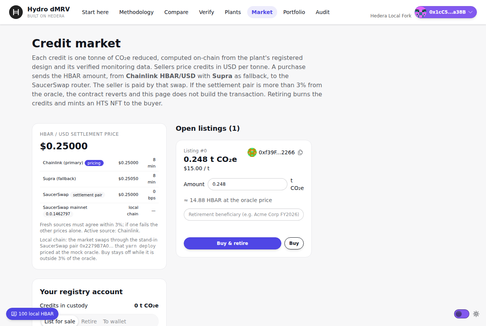
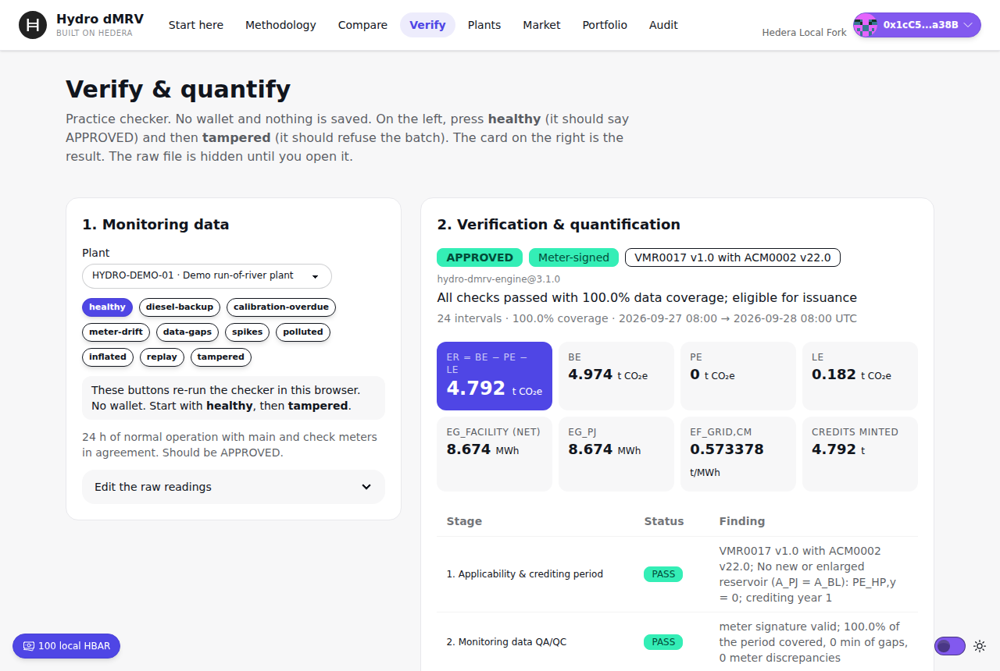
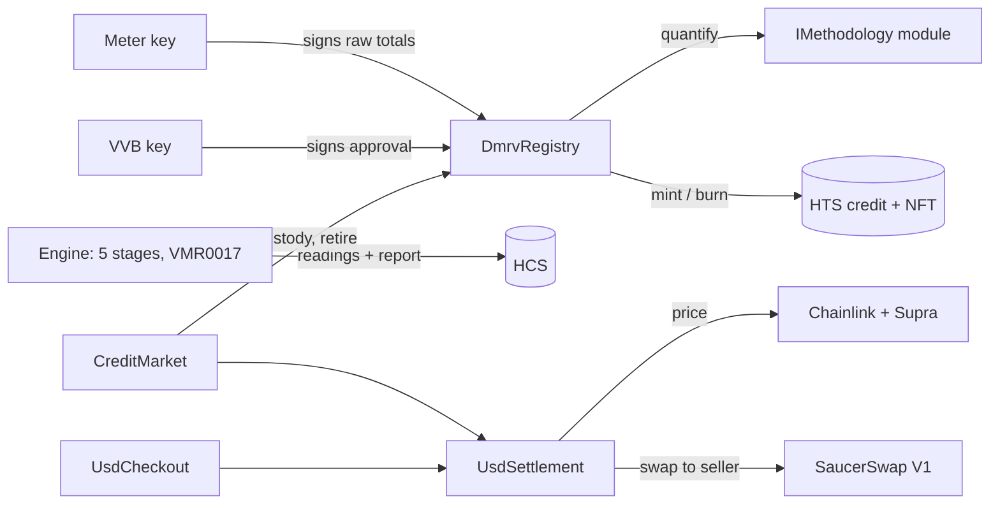

# Hydro dMRV

**Guardian decides what a credit is. This template makes the token prove it on-chain.**

[Hedera Guardian](https://github.com/hashgraph/guardian) runs carbon methodology policies, roles and verifiable credentials; its library already ships the hydro methodologies (CDM ACM0002, AMS-I.D). Two things it leaves off-chain: a Guardian mint is whatever number a policy rule computes, minted by the Guardian service, and a minted credit has no price, no market and no contract another dApp can call. This Scaffold-HBAR template is that on-chain half, for EVM developers building on Hedera credits.

- **Issuance a contract enforces.** `DmrvRegistry` holds the HTS supply key and mints only with two EIP-712 signatures (the plant's meter over the raw totals, a VVB over that statement, who may only lower figures), and only the integer its methodology module recomputes: `ER = BE − PE − LE`. Readings and reports go to HCS, so anyone can re-derive a mint.
- **Dollar-priced settlement anyone can reuse.** `UsdSettlement` prices in USD from Chainlink with a Supra fallback and pays the seller through SaucerSwap, only while the pool sits within 3% of the oracle. `CreditMarket` uses it for credits (with retirement NFTs); `UsdCheckout` uses it for **any** HTS fungible token.
- **A buyer's check on any Guardian token.** `trace_guardian_mint` follows a Guardian mint to the signed VP behind it, from the public mirror node and IPFS (every block hashed against its CID): signatures, the MintToken VC's token and amount, and whether the signer is the token's treasury. `backed`, `not-backed` or `incomplete`, with no Guardian login.
- **Agents as buyers and auditors.** An MCP server with a REST twin for every tool: reproduce a mint from HCS, then buy and retire with your own wallet.

Hydropower under Verra VMR0017 v1.0 with ACM0002 v22.0 is the worked example, not the limit: another methodology is another stateless `IMethodology` module.

| | Guardian / Managed Guardian | This template |
| --- | --- | --- |
| Methodology policies, roles, VC/DID documents, trust chain | Yes | No, use Guardian |
| Who decides the minted amount | A policy rule, run by the Guardian service | The contract, with meter and VVB signatures |
| Price, sale, DEX settlement, a contract to compose with | No | Chainlink + Supra, SaucerSwap, `CreditMarket`, `UsdCheckout` |
| A buyer or agent checking a minted token | Trust chain in the Guardian UI; the indexer API needs an account | `trace_guardian_mint` / `GET /api/guardian/v1/trace`, public data only |
| How you start | Docker services and MongoDB, or MGS | `npm create scaffold-hbar` |

| Market: oracle price, SaucerSwap check, listing | Verify: the five-stage engine on a day of readings |
| --- | --- |
|  |  |

> **Disclaimer.** Contracts, app and tooling are experimental and not audited. The engine implements published equations; it is not a certification body. Do not use it in production without a security review.

## Quick start: a working market in five minutes, no Hedera account

Prerequisites: Node.js ≥ 20.18.3, Git, Yarn via Corepack (`corepack enable`).

```bash
npm create scaffold-hbar@latest -- hydro-dmrv \
  --template BikramBiswas786/Hedera-hydropower-dMRV-with-5-layer-verification-
cd hydro-dmrv

# cloned this repo instead? run `yarn install` first
yarn chain:offline                 # terminal 1: local chain
yarn deploy --network localhost    # terminal 2: contracts, stand-ins, one minted batch, one listing
yarn start                         # terminal 3: http://localhost:3000
```

The deploy installs local stand-ins for HTS, Chainlink, Supra and SaucerSwap, registers two demo plants, mints one hour of `HYDRO-DEMO-01` signed by its demo meter key and a local VVB key, and lists the credits at $15/t. `yarn start` sees the local deploy and targets it. Open `/market`, press **100 local HBAR** in the footer to fund the burner wallet, then **Buy & retire**; the retirement and its certificate appear in `/portfolio`. All keys on a local chain are public demo keys; the deploy refuses them on Hedera.

Then:

- `/verify` runs the five-stage engine: `healthy` passes, `inflated` and `tampered` do not.
- `yarn test` runs 174 contract tests and 302 app tests, including the Solidity and TypeScript quantification agreeing on the same integers.

## Deploy to Hedera testnet

```bash
yarn hardhat:account:import                            # an ECDSA testnet account from portal.hedera.com
yarn hardhat:meter-keys --network hederaTestnet        # one meter key per plant (.secrets/, gitignored)
yarn deploy --network hederaTestnet                    # creates the HTS token and NFT collection
yarn mrv:create-topic                                  # the HCS audit topic
yarn mrv:attest healthy HYDRO-DEMO-01                  # step 1: verify and anchor on HCS
VVB_PRIVATE_KEY=0x… yarn mrv:approve attest-HYDRO-DEMO-01-0.json   # the VVB signs on its own machine
yarn mrv:submit attest-HYDRO-DEMO-01-0.json            # step 2: relay both signatures; the contract mints
```

| Variable (`packages/nextjs/.env.local`) | Needed for |
| --- | --- |
| `HEDERA_OPERATOR_ID`, `HEDERA_OPERATOR_KEY`, `HCS_TOPIC_ID` | publishing readings and reports to HCS |
| `MRV_API_KEY` | the attestation API and MCP write tool (unset: writes are off) |
| `NEXT_PUBLIC_TARGET_NETWORK` | `local` or `testnet`, to override the automatic choice |

`packages/hardhat/.env` takes `VERIFIER_ADDRESS` (the VVB) and `ADMIN_ADDRESS` (a 2-of-3 threshold account). Every variable is in [docs/operations.md](docs/operations.md).

## Architecture


```mermaid
flowchart LR
  M[Meter key] -- signs raw totals --> R
  V[VVB key] -- signs approval --> R
  E[Engine: 5 stages, VMR0017] -- readings + report --> H[(HCS)]
  R[DmrvRegistry] -- quantify --> Q[IMethodology module]
  R -- mint / burn --> T[(HTS credit + NFT)]
  C[CreditMarket] --> S[UsdSettlement]
  K[UsdCheckout] --> S
  S -- price --> O[Chainlink + Supra]
  S -- swap to seller --> D[SaucerSwap V1]
  C -- custody, retire --> R
```

Hedera services in play: **HTS** (a credit token and an NFT collection whose treasury, admin and supply keys are the registry contract), **HCS** (raw readings and reports, re-derived from the mirror node), **smart contracts** on the Hedera EVM with the HTS system contract at `0x167`, and the **Schedule Service** (admin calls from a 2-of-3 threshold account as `ScheduleCreate` / `ScheduleSign`, `yarn admin:exec`).

```
packages/hardhat/
  contracts/            DmrvRegistry, CreditMarket, UsdCheckout, ResilientHbarUsdFeed
    settlement/         UsdSettlement: oracle price, SaucerSwap pool guard, swap to seller
    modules/            HydroVmr0017Module (IMethodology)
    lib/                HederaTokenLib: every HTS call, response codes to reverts
    legacy/             the phase-0 registry, kept so its testnet mints still reproduce
  deploy/               00 contracts · 01 setup · 02 UsdCheckout · 03 local demo batch
  test/                 174 tests, incl. MainnetFork.test.ts (CI forks mainnet)
packages/nextjs/
  app/                  /verify /plants /market /portfolio /audit /methodology, api/**, api/mcp
  services/mrv/         the pure engine, methodology, HCS messages, audit; server/ holds keys and writes
  scripts/              mrv:* attestation CLI, admin:*, pair keeper, live smoke
```

## Scripts

| Command | What it does |
| --- | --- |
| `yarn chain:offline` · `yarn deploy --network localhost` · `yarn start` | Local chain, contracts and demo batch, app |
| `yarn test` · `yarn lint` · `yarn next:build` | Contract and app tests, lint, production build |
| `yarn hardhat:size` | Contract-size gate (24,064 B) |
| `yarn mrv:attest` · `yarn mrv:approve` · `yarn mrv:submit` | Two-signature attestation from the CLI |
| `yarn admin:threshold` · `yarn admin:exec` | 2-of-3 admin account and scheduled admin calls |
| `yarn live:smoke` · `yarn pair:rebalance` · `yarn market:keep-listing` | Check the live app; keep the testnet pair and a listing healthy |
| `yarn guardian:trace <ref>` | Is a Guardian-minted token backed? Mirror node + CID-checked IPFS, no Guardian login |
| `yarn hardhat:verify:testnet <address> [args]` | Verify a deployment on Sourcify (HashScan shows the source) |

## Live on testnet

App: [hydro-dmrv.vercel.app](https://hydro-dmrv.vercel.app). Market [`0x5aeDe76f…`](https://hashscan.io/testnet/contract/0x5aeDe76fc6625cfA3227FFf70197D4D7ff3e5030), a [meter + VVB signed mint](https://hashscan.io/testnet/transaction/0x321b6d20db7b24eaee672160fcb9643d6fafd357c204934e892446ac6db11b6e), a [`buyAndRetire` through SaucerSwap](https://hashscan.io/testnet/transaction/0x4735808481bde453a2354b4ed395a00ba72112fdcbb0b96c9a1196e4c5753fab), and a [`UsdCheckout` sale](https://hashscan.io/testnet/transaction/0x51c9b0062bd36e119fbefe8b6e58e18717be1a5ea10fc2d54116a1d768ae379d). All five testnet contracts are Sourcify-verified (exact match), so HashScan shows their source. Every address and what each transaction proves is in [docs/evidence.md](docs/evidence.md).

Four workflows keep this true:

- [Live smoke](https://github.com/BikramBiswas786/Hedera-hydropower-dMRV-with-5-layer-verification-/actions/workflows/live-smoke.yml) (every 6 h and after each production deploy) clicks through the deployed app with no wallet: the pairs against their oracles, an open listing, an unsigned purchase, every mint re-derived from HCS, a real Guardian mint traced, the scenarios, the MCP tools.
- [Guardian trace](https://github.com/BikramBiswas786/Hedera-hydropower-dMRV-with-5-layer-verification-/actions/workflows/guardian-trace.yml) (daily) traces a real Guardian iRec mint on testnet to its signed VP and the treasury's DID.
- [Mainnet fork](https://github.com/BikramBiswas786/Hedera-hydropower-dMRV-with-5-layer-verification-/actions/workflows/mainnet-fork.yml) (every push) runs the settlement against SaucerSwap's real factory, the public WHBAR/USDC pair and mainnet Chainlink.
- [Testnet pair keeper](https://github.com/BikramBiswas786/Hedera-hydropower-dMRV-with-5-layer-verification-/actions/workflows/testnet-pair-keeper.yml) (hourly) holds the seeded testnet pair at the oracle price, which it must: the pair does not follow HBAR, the oracle does and keeps a listing open.
- [Checkout testnet demo](https://github.com/BikramBiswas786/Hedera-hydropower-dMRV-with-5-layer-verification-/actions/workflows/checkout-testnet-demo.yml) (on demand) deploys `UsdCheckout` next to the live contracts and makes one sale.

## Use it without carbon

Most Hedera apps that sell something want a dollar price and HBAR payment. `UsdCheckout` puts the settlement in front of any HTS fungible token: tickets, real-world-asset shares, in-game items.

```solidity
// seller: token.approve(checkout, amount) on the HTS token's ERC-20 facade, then
checkout.createListing(token, amount, 1_250);        // $12.50 per whole token, escrowed in the checkout
// buyer: token.associate() once (HIP-719), then
uint256 tinybar = checkout.quote(listingId, amount); // Chainlink (Supra fallback), after SaucerSwap agrees within 3%
checkout.buy{ value: tinybar }(listingId, amount);   // HBAR is swapped to the pair's USD token for the seller
```

A stale feed, a pool more than 3% from the oracle, or a pool SaucerSwap's factory did not create blocks the sale rather than making it cheaper, and no admin function can move escrowed tokens ([tests](packages/hardhat/test/UsdCheckout.test.ts)).

## For AI agents

```bash
claude mcp add --transport http hydro-dmrv https://hydro-dmrv.vercel.app/api/mcp
```

`get_dex_price → list_open_listings → prepare_purchase → sign and send` buys with the agent's own key; `reproduce_attestation` re-derives any mint from HCS. Public tools need no key; `submit_attestation` appears only with `Authorization: Bearer $MRV_API_KEY`. Tools, REST twins and OpenAPI: [docs/agents.md](docs/agents.md).

Writing Hedera code with an agent? [`HEDERA_FACTS.md`](HEDERA_FACTS.md) lists 20 Hedera behaviours that break code (tinybar vs weibar, HTS response codes, association, the testnet USDC pair, forking limits), each with the test or workflow that proves it. [`AGENTS.md`](AGENTS.md) has the repo's invariants and recipes for a new methodology or a new asset to sell.

## Docs

| | |
| --- | --- |
| Testnet addresses and transactions, how buying works, keys, limits | [docs/evidence.md](docs/evidence.md) |
| Registry, module, market and checkout functions, EIP-712 types, roles, pool guard | [docs/contract.md](docs/contract.md) |
| Equations, five stages, scenarios, HCS reproduction | [docs/methodology.md](docs/methodology.md) |
| Environment variables, pages, layout, security limits | [docs/operations.md](docs/operations.md) |
| What the tests pin | [docs/testing.md](docs/testing.md) |
| Guardian: buyer's mint trace, cross-check VC, evidence check, policy patch | [docs/GUARDIAN.md](docs/GUARDIAN.md) |
| MCP tools and REST twins | [docs/agents.md](docs/agents.md) |

Hedera Harness spec and validators are in [`.harness/`](.harness/); `yarn harness:validate` runs Tiers 0–2 with no credentials.

## Limits, stated plainly

- The testnet SaucerSwap pair was seeded with 20 HBAR against a test token this project minted, so testnet sellers are paid in that token, and a small trade can push the pair out of band (the keeper pulls it back). On mainnet the same code uses the public WHBAR/USDC pair.
- The VVB and meter keys on testnet are labelled test keys, not an accredited verifier or data-logger hardware.
- The testnet contracts predate three hardening changes in the source; [docs/evidence.md](docs/evidence.md) lists them.
- The engine implements VMR0017 v1.0 / ACM0002 v22.0 equations. A VVB and a registry still decide issuance; these credits are not a Verra issuance.

MIT, see [LICENCE](LICENCE). Built on [Scaffold-HBAR](https://github.com/hedera-dev/scaffold-hbar).
