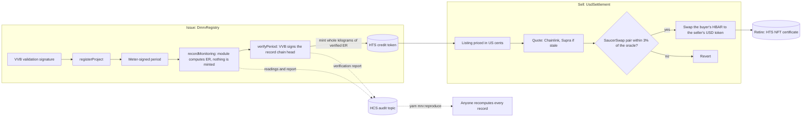

# Hydro dMRV

One command gives you a local market where you can buy and retire a carbon credit. No Hedera account is required for that.

The contract decides how many tonnes exist. A validator signs the plant design before it can be registered. The plant's meter signs each monitoring period, and that signature does not mint. A second signature, from a verifier over a run of those periods, is what issues tonnes, and it can only lower the figure. The sale prices HBAR from Chainlink, uses Supra when Chainlink is stale, and reverts unless the HBAR is swapped through SaucerSwap. The readings are on HCS, so anyone can recompute the number.

## Read this in order

| You want | Go to |
| --- | --- |
| A market on your machine, in five minutes | [Quick start](#quick-start-a-working-market-in-five-minutes-no-hedera-account) |
| What stops working if SaucerSwap or an oracle is removed | [Ecosystem integrations](#ecosystem-integrations-and-what-breaks-without-them) |
| The transactions to open first | [Check it on testnet](#check-it-on-testnet) |
| Every address, key and limit | [docs/evidence.md](docs/evidence.md) |
| The equations, clause by clause | [docs/methodology.md](docs/methodology.md), then [docs/standards.md](docs/standards.md) |
| An agent editing this repo | [AGENTS.md](AGENTS.md) and [HEDERA_FACTS.md](HEDERA_FACTS.md) |

## Prerequisites

- Node.js 20.18.3 or newer (CI uses 20.18.3, pinned in `.nvmrc`)
- Git
- Yarn, from Corepack: `corepack enable`

That is enough for the quick start. A funded ECDSA testnet account is required only in [Deploy to Hedera testnet](#deploy-to-hedera-testnet).

## Quick start: a working market in five minutes, no Hedera account

```bash
npm create scaffold-hbar@latest -- hydro-dmrv \
  --template BikramBiswas786/Hedera-hydropower-dMRV-with-5-layer-verification-
cd hydro-dmrv

# cloned this repo instead? run `yarn install` first
yarn chain:offline                 # terminal 1: local chain
yarn deploy --network localhost    # terminal 2: contracts, stand-ins, a validated plant, one verified record, one listing
yarn start                         # terminal 3: http://localhost:3000
```

The deploy installs local stand-ins for HTS, Chainlink, Supra and SaucerSwap. It registers two demo plants, records one hour of `HYDRO-DEMO-01` signed by its demo meter, has the local verifier issue the credits, and lists them at $15/t. The local chain is written to gitignored `deployedContracts.local.ts`. The committed testnet addresses are not rewritten, so `yarn test` still passes in that same checkout. `yarn start` then targets that local chain. Open `/market`. A burner wallet connects on its own. Press **100 local HBAR** in the footer, then **Buy & retire**. The certificate is on `/portfolio`.

`yarn verify` is only the engine. `healthy` is approved. `inflated` and `tampered` are rejected, and the line says why. No chain, no wallet, no VVB key. `yarn demo` does the deploy, runs those three checks, and buys 10 kg. Then `yarn start`. Issuing on testnet is still the four commands below. The server never holds the VVB key.

`/verify` runs the five-stage engine. The `healthy` case passes. `inflated` and `tampered` do not. `yarn test` runs 152 contract tests and 416 app tests. The Solidity and TypeScript quantification must agree on the same integers.

All keys on a local chain are public demo keys. The deploy refuses those keys on Hedera.

| Market: oracle price, SaucerSwap check, listing | Verify: the five-stage engine on a day of readings |
| --- | --- |
|  |  |

## How a tonne is issued

A **VVB** is the independent body that signs off a project. **Validation** approves the design before the plant may earn anything. A **monitoring record** is one metered period. The contract computes its emission reduction, **ER = BE − PE − LE** (baseline minus project emissions minus leakage), and mints nothing. **Verification** is the VVB's signature over a run of records. Only that signature mints. One token is one tonne of CO₂e. One base unit is one kilogram. **Retirement** burns credits for a named beneficiary and mints an NFT certificate.

Guardian still runs the policy, the roles and the credentials. This template is the part Guardian does not run: on-chain quantification, the hash chain, and a sale. `UsdCheckout` sells any HTS fungible token with the same price and swap, so the market still builds if the hydro module is removed.

## Architecture

| Package | What it owns |
| --- | --- |
| `packages/hardhat` | `DmrvRegistry` (validation, monitoring, verification, issuance, and every HTS call), `HydroVmr0017Module` and `RenewableVmr0017Module` (the maths), `CreditMarket` and `UsdCheckout` (a USD price settled on SaucerSwap), `ResilientHbarUsdFeed` (Chainlink, then Supra) |
| `packages/nextjs` | The same maths in TypeScript, the pages, REST, and the MCP server |


```mermaid
flowchart LR
  subgraph Issue["Issue: DmrvRegistry"]
    VAL["VVB validation signature"] --> REG["registerProject"]
    REG --> MET["Meter-signed period"]
    MET --> REC["recordMonitoring: module computes ER, nothing is minted"]
    REC --> VER["verifyPeriod: VVB signs the record chain head"]
    VER -->|"mint whole kilograms of verified ER"| TOK[("HTS credit token")]
  end
  subgraph Sell["Sell: UsdSettlement"]
    LST["Listing priced in US cents"] --> QUO["Quote: Chainlink, Supra if stale"]
    QUO --> GRD{"SaucerSwap pair within 3% of the oracle?"}
    GRD -->|yes| SWP["Swap the buyer's HBAR to the seller's USD token"]
    GRD -->|no| REV["Revert"]
  end
  TOK --> LST
  SWP --> RET[("Retire: HTS NFT certificate")]
  REC -. "readings and report" .-> HCS[("HCS audit topic")]
  VER -. "verification report" .-> HCS
  HCS -. "yarn mrv:reproduce" .-> ANY["Anyone recomputes every record"]
```

The registry holds the credit token's supply key. A methodology module is called with `staticcall` and cannot mint. The file tree is in [docs/operations.md](docs/operations.md#project-structure).

## Ecosystem integrations, and what breaks without them

A developer can put a US-dollar price on any HTS token, take payment in HBAR, and settle through SaucerSwap. The sale refuses a stale price, two oracles that disagree, and a pool that is off the market or that SaucerSwap's factory did not create. `UsdCheckout` is three calls. See [Use it without carbon](#use-it-without-carbon).

| Integration | What it does here | Remove it and | Code | On-chain proof |
| --- | --- | --- | --- | --- |
| **SaucerSwap V1** (router and factory) | Every sale swaps the buyer's HBAR to the seller's USD token through the router. The pool guard asks the factory's `getPair` for the pool, then blocks sales while its price is more than 3% from the oracle | There is no sale: `buy` and `buyAndRetire` revert | [`UsdSettlement.sol`](packages/hardhat/contracts/settlement/UsdSettlement.sol) | [buyAndRetire 0x180f3a7c…](https://hashscan.io/testnet/transaction/0x180f3a7c2d0285a6a2ee0841c417232058a615093143c0a24489d396546178c0); the same guard against mainnet pair `0.0.1462797` in the [Mainnet fork](.github/workflows/mainnet-fork.yml) workflow |
| **Chainlink** HBAR/USD | Converts every US-cent price to tinybar | Nothing can be quoted | [`ResilientHbarUsdFeed.sol`](packages/hardhat/contracts/ResilientHbarUsdFeed.sol) | [`/api/market/dex`](https://hydro-dmrv.vercel.app/api/market/dex) reads it live |
| **Supra** HBAR/USDT (pair 75) | Takes over when Chainlink is stale. When both are fresh and disagree by more than 3%, sales stop | One stale feed no longer has a fallback, so a stale Chainlink price pauses every sale | same | [`ResilientHbarUsdFeed.test.ts`](packages/hardhat/test/ResilientHbarUsdFeed.test.ts): fresh, stale, broken, disagreeing |
| **Hedera Guardian** and **IPFS** | `trace_guardian_mint` checks a Guardian mint's signed VP and its CID-checked IPFS documents. For a token the admin has marked, `UsdCheckout.buy` reverts and `buyTraced` checks a signature made only after that trace is backed | A marked token cannot be bought by skipping the trace. An unmarked token still can | [`UsdCheckout.sol`](packages/hardhat/contracts/UsdCheckout.sol), [`services/mrv/guardian/`](packages/nextjs/services/mrv/guardian/) | [token marked 0xc9937356…](https://hashscan.io/testnet/transaction/0xc99373563d891c814b86666674a2b9b1c8e271a7a5be2a01812a35ecf0f547cc), then [buyTraced 0x42212e6d…](https://hashscan.io/testnet/transaction/0x42212e6d7edc6725f9813921fe35d340c8bf7c91ccfafb92c31471895ba7e3ad) on [0xa42B11B3…](https://hashscan.io/testnet/contract/0xa42B11B322a6Dd1B638abe69Aa6671A45C85Ab75). `buy` on that checkout reverts |

On testnet the public WHBAR/USDC pair prices HBAR near $2, so the sale swaps through a SaucerSwap V1 pair seeded at the oracle price and kept there by a [keeper](.github/workflows/testnet-pair-keeper.yml). On mainnet the same contract points at the public pair. The swap is not executed on the fork. The router quote is.

## Hedera services used

| Service | Where | What for |
| --- | --- | --- |
| Token Service (HTS), through the system contract at `0x167` | [`HederaTokenLib.sol`](packages/hardhat/contracts/lib/HederaTokenLib.sol), used only by `DmrvRegistry` and `UsdCheckout` | The credit token (3 decimals) and the retirement NFT. The registry creates both and holds their treasury and supply keys. `UsdCheckout` escrows any HTS token |
| Consensus Service (HCS) | [`report.ts`](packages/nextjs/services/mrv/report.ts), [`verification.ts`](packages/nextjs/services/mrv/verification.ts) | Raw readings (up to 20 chunks), the monitoring report and the verification report. The contract stores each report's hash and sequence |
| Smart contracts | [`packages/hardhat/contracts`](packages/hardhat/contracts) | Registry, methodology modules (called with `staticcall`), market, checkout, price feed |
| Schedule Service | [`adminExec.ts`](packages/nextjs/scripts/adminExec.ts) | Admin calls from a 2-of-3 threshold account: one holder schedules, a second signs |
| Mirror node | [`mirror.ts`](packages/nextjs/services/mrv/mirror.ts) | Reads HCS messages, token associations and contract results back, so a record can be reproduced |

## Environment variables

Nothing is required for the local quick start, or to browse the app. Copy the `.env.example` beside each package when you leave localhost.

| Variable (`packages/nextjs/.env.local`) | Needed for |
| --- | --- |
| `HEDERA_OPERATOR_ID`, `HEDERA_OPERATOR_KEY`, `HCS_TOPIC_ID` | Publishing readings and reports to HCS |
| `MRV_API_KEY` | The record and verification APIs, and the MCP write tools. Unset: writes are off |
| `CHECKOUT_ADDRESS` | The `UsdCheckout` the server reads. Production is `0xa42B11B322a6Dd1B638abe69Aa6671A45C85Ab75`, where a marked token cannot use `buy`. Unset: the checkout written by the last deploy |
| `TRACE_SIGNER_KEY` | The ECDSA key that signs `buyTraced` after a Guardian trace is backed. Without it the server will not build a purchase of a marked token. Never commit it |
| `NEXT_PUBLIC_TARGET_NETWORK` | `local` or `testnet`, when you want to override the automatic choice |

`packages/hardhat/.env` takes `VERIFIER_ADDRESS` (the VVB, which must sign each plant's validation before it is registered) and `ADMIN_ADDRESS` (a 2-of-3 threshold account). The full list is in [docs/operations.md](docs/operations.md).

## Deploy to Hedera testnet

```bash
yarn hardhat:account:import                            # an ECDSA testnet account from portal.hedera.com
yarn hardhat:meter-keys --network hederaTestnet        # one meter key per plant (.secrets/, gitignored)
yarn deploy --network hederaTestnet                    # creates the HTS token and NFT collection
yarn mrv:create-topic                                  # the HCS audit topic
yarn mrv:record healthy HYDRO-DEMO-01                  # monitoring: verify, publish to HCS, record (issues nothing)
yarn mrv:verify HYDRO-DEMO-01                          # the VVB's report on HCS; writes verification-HYDRO-DEMO-01-0-0.json
VVB_PRIVATE_KEY=0x… yarn mrv:approve verification-HYDRO-DEMO-01-0-0.json   # the VVB signs on its own machine
yarn mrv:submit verification-HYDRO-DEMO-01-0-0.json    # relay it; the approval issues the credits
yarn mrv:reproduce                                     # anyone: re-derive every record from HCS
```

## Check it on testnet

Open these four. The rest of the cycle, including the deficit plant, the Guardian trace, the 2-of-3 schedule and the older checkout, is in [docs/evidence.md](docs/evidence.md).

| What | Open it |
| --- | --- |
| A sale. The buyer's HBAR is swapped on SaucerSwap and the credits are retired | [0x180f3a7c…](https://hashscan.io/testnet/transaction/0x180f3a7c2d0285a6a2ee0841c417232058a615093143c0a24489d396546178c0) · [would a sale settle now?](https://hydro-dmrv.vercel.app/api/market/dex) |
| The signature that minted. Two meter-signed days, 1.537 t, nothing minted before this transaction | [0xffe81724…](https://hashscan.io/testnet/transaction/0xffe81724e83bc9fd4e85bae234e3654588d48f0833a0e18fc865f25fd0e391c4) |
| A monitoring record. Quantified on-chain. Issues nothing | [0x0e3ed83c…](https://hashscan.io/testnet/transaction/0x0e3ed83c7a946f9b3ace4fa313d0beb11f57b11aa863efead770d82cb9e30d39) · [reproduce it from HCS](https://hydro-dmrv.vercel.app/api/registry/attestations/0/reproduce) |
| A marked Guardian token. `buy` reverts. `buyTraced` is the sale | [0x42212e6d…](https://hashscan.io/testnet/transaction/0x42212e6d7edc6725f9813921fe35d340c8bf7c91ccfafb92c31471895ba7e3ad) on [0xa42B11B3…](https://hashscan.io/testnet/contract/0xa42B11B322a6Dd1B638abe69Aa6671A45C85Ab75) |

The [Testnet evidence](.github/workflows/testnet-evidence.yml) workflow ran the cycle with the same commands an operator and a VVB use. The six testnet contracts are Sourcify-verified (exact match). The public mainnet pair `0.0.1462797` is quoted on every push by the [Mainnet fork](.github/workflows/mainnet-fork.yml) workflow. The swap is not executed there.

## Limits, stated plainly

- **These are not Verra credits.** The registry issues its own units from the equations it implements. The demo plants' additionality evidence is illustrative. On testnet one person holds the operator, meter and labelled demo VVB keys. A real deployment must not do that.
- The testnet SaucerSwap pair holds a USD token this project minted, because the public testnet USDC pair prices HBAR near $2. A keeper holds the seeded pair at the oracle. A large purchase can push it out of band until the keeper runs. On mainnet the same code uses the public WHBAR/USDC pair.
- The contract cannot verify a Guardian VP. For a marked token, `buy` reverts and `buyTraced` checks a signature this server creates only after the trace is backed. An unmarked token is not a Guardian mint. The checkout deployed before that function, `0x455eFbF0…`, still sells with `buy`.
- The demo grid factor is Uganda's published CDM standardized baseline (ASB0054-2022). It expired on 9 August 2025. The demo plants were registered in 2026, outside that window. The tonnes illustrate the arithmetic. A real project needs a new grid factor.
- The contract checks that each record cites a non-zero sequence on HCS topic `0.0.10729650`. It cannot read the message. `yarn mrv:reproduce` refuses a mismatch. A direct `verifyPeriod` call can still cite a sequence whose bytes are something else.
- `evidenceHash` is an optional label. The contract does not check what it names.
- A monitoring run the VVB rejects still counts toward that year's energy for a retrofit or a capacity addition. Both demo plants are greenfield, so this does not affect them. Detail is in [docs/contract.md](docs/contract.md).
- Meter uncertainty is reported with each record. It is not deducted from the tonnes. The lower of two meters, and the maximum permissible error after calibration expires, are deducted.

> **Disclaimer.** The contracts, the app and the tooling are experimental and have not been audited. The engine implements published equations. It is not a certification body.

## Use it without carbon

Most Hedera apps that sell something want a dollar price and an HBAR payment. `UsdCheckout` is that settlement, in front of any HTS fungible token: tickets, shares, in-game items.

```solidity
// seller: token.approve(checkout, amount) on the HTS token's ERC-20 facade, then
checkout.createListing(token, amount, 1_250);        // $12.50 per whole token, escrowed in the checkout
// buyer: token.associate() once (HIP-719), then
uint256 tinybar = checkout.quote(listingId, amount); // Chainlink (Supra fallback), after SaucerSwap agrees within 3%
checkout.buy{ value: tinybar }(listingId, amount);   // HBAR is swapped to the pair's USD token for the seller
```

A stale feed, a pool more than 3% from the oracle, or a pool SaucerSwap's factory did not create blocks the sale. No admin function can move escrowed tokens. The tests are in [`UsdCheckout.test.ts`](packages/hardhat/test/UsdCheckout.test.ts).

## For AI agents

```bash
claude mcp add --transport http hydro-dmrv https://hydro-dmrv.vercel.app/api/mcp
```

`get_dex_price`, then `list_open_listings`, then `prepare_purchase`. The agent signs with its own key. `reproduce_attestation` re-derives a record from HCS. `get_pending_verification` shows what a VVB should verify next. Public tools need no key. `record_monitoring`, `prepare_verification` and `submit_verification` appear only with `Authorization: Bearer $MRV_API_KEY`. None of them signs as a VVB. The tool list is [docs/agents.md](docs/agents.md).

[`HEDERA_FACTS.md`](HEDERA_FACTS.md) lists Hedera behaviours that break ordinary contract code, each with the test that proves it. [`AGENTS.md`](AGENTS.md) has the invariants, and the recipes for a new methodology or a new asset to sell.

## Troubleshooting

| Symptom | Cause | Fix |
| --- | --- | --- |
| A purchase overpays by 10¹⁰, or reverts `InsufficientPayment` | `msg.value` is tinybar inside the EVM. A JSON-RPC `value` is weibar | Send what `quote()` returns, through `quoteToTxValue` ([`pricing.ts`](packages/nextjs/services/mrv/pricing.ts)) |
| The relay rejects a transaction for its fee | Hashio refuses EIP-1559 fees under its minimum gas price | Send a legacy transaction at `eth_gasPrice`, as the scripts do |
| `HtsCallFailed(…, 184)` on a purchase or a withdrawal | The receiving account is not associated with the token | Call `associate()` on the token's own address first (HIP-719) |
| `HtsCallFailed(…, 292)` on `createListing` | The checkout has no allowance on the seller's token | `approve(checkout, amount)` on the token's ERC-20 facade |
| `PoolPriceDeviation`, or [`/api/market/dex`](https://hydro-dmrv.vercel.app/api/market/dex) shows `accepted: false` | The testnet pair drifted more than 3% from the oracle | Wait for the keeper, or run `yarn pair:rebalance --execute` |
| `StalePrice` | No oracle answer is newer than the market's maximum price age | Retry later. `/api/market/dex` shows each feed's age |
| `yarn deploy` changes nothing you can see | Without `--network` it deploys to an in-process chain that exits | Start `yarn chain:offline`, then `yarn deploy --network localhost` |
| `yarn test` fails after a local deploy, or `deployedContracts.ts` contains chain 31337 | An older deploy wrote the local chain into the committed file | `yarn reset:local`, then deploy again. A current deploy writes gitignored `deployedContracts.local.ts` and leaves the committed file alone |
| `yarn lint` fails inside `generator-function/require.mjs` on Node 22 | That package's `module-sync` export is ESM, and Node 22.13 loads it from CommonJS ESLint | This repo patches it to the CommonJS entry. CI uses Node 20.18.3. Do not delete the patch under `.yarn/patches` |
| `yarn start` restarts, saying the server is approaching its memory threshold | The first compile is large. An older config also made webpack snapshot `node_modules` | Restart `yarn start`. Do not set a Node heap bigger than about half the machine's RAM |
| Check evidence, a quote, or `yarn mrv:reproduce` sits there | The mirror node or an IPFS gateway did not answer | The read fails after 12 seconds (`UPSTREAM_TIMEOUT_MS`). Retry. The contract still cannot read the HCS message itself |
| The API returns 429 | This instance saw 300 calls in a minute from one address | Wait for `Retry-After`. Instances do not share the counter, so a public site should also set a Vercel Firewall rule on `/api/*` |
| I only want to see a rejection | The testnet VVB commands need an operator and a separate key | `yarn verify`, or open `/verify` and press **tampered**. `yarn mrv` prints both paths. A local listing is already issued by `yarn deploy` |
| A testnet deploy stops at the meter keys | Live networks refuse the public demo meter keys | `yarn hardhat:meter-keys --network hederaTestnet` |
| HashPack says the site is a malicious dapp, or "No applicable ECDSA accounts" | WalletConnect's shared project id is flagged, and an ED25519 account cannot sign | Use HashPack's ECDSA account, or MetaMask. `NEXT_PUBLIC_WALLET_CONNECT_PROJECT_ID` clears the warning. The HashPack extension does not use that check |

Each row has a test or a workflow behind it, listed in [`HEDERA_FACTS.md`](HEDERA_FACTS.md).

## How it compares to Guardian

| | Guardian | This template |
| --- | --- | --- |
| Policies, roles, credentials, trust chain | Yes | No. Use Guardian |
| Who decides the minted amount | A policy, run by the Guardian service | The contract, from meter-signed records, and only after a VVB signs |
| Price, sale, DEX settlement | No | Chainlink, Supra, SaucerSwap, `CreditMarket`, `UsdCheckout` |
| A buyer checking a minted token | The Guardian UI. The indexer needs an account | `GET /api/guardian/v1/trace`, from public data |
| How you start | Docker and MongoDB, or Managed Guardian | `npm create scaffold-hbar` |

## Docs

| | |
| --- | --- |
| Every testnet address, transaction, key and limit | [docs/evidence.md](docs/evidence.md) |
| Registry, module, market and checkout: functions, EIP-712 types, roles | [docs/contract.md](docs/contract.md) |
| Equations, five stages, scenarios, HCS reproduction | [docs/methodology.md](docs/methodology.md) |
| Which clause of VMR0017, ACM0002, AMS-I.D and the VT tools is implemented where | [docs/standards.md](docs/standards.md) |
| Environment, scripts, pages, security limits | [docs/operations.md](docs/operations.md) |
| What the tests pin | [docs/testing.md](docs/testing.md) |
| Guardian trace, the cross-check credential, the policy patch | [docs/GUARDIAN.md](docs/GUARDIAN.md) |
| MCP tools and their REST twins | [docs/agents.md](docs/agents.md) |

Hedera Harness spec and validators are in [`.harness/`](.harness/). `yarn harness:validate` runs Tiers 0–2 with no credentials.

MIT, see [LICENCE](LICENCE). Built on [Scaffold-HBAR](https://github.com/hedera-dev/scaffold-hbar).
