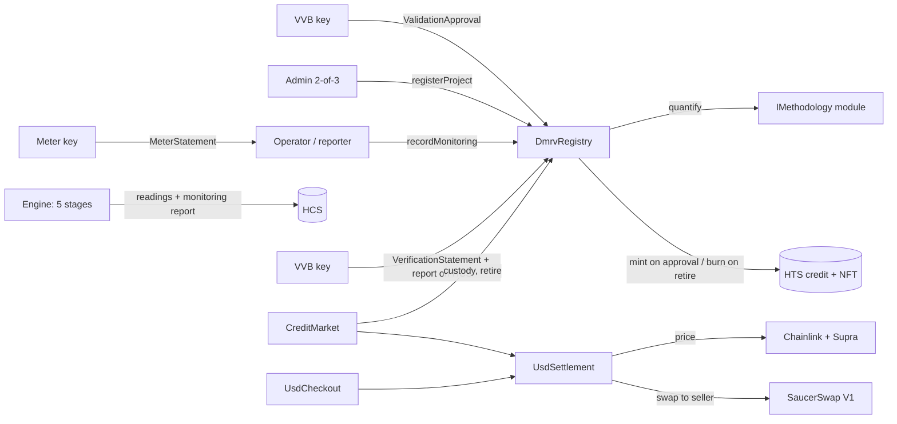

# Contracts and oracle

The on-chain half is five contracts plus a second methodology module:

| Contract | Role | Size (`yarn hardhat:size`) |
| --- | --- | --- |
| `DmrvRegistry.sol` | The VCS project cycle: VVB-validated registration, meter-signed monitoring records in a hash chain, VVB verification that issues, custody, retirement, certificates, and every HTS call (only here) | 24,011 B |
| `modules/HydroVmr0017Module.sol` | Stateless `IMethodology`: VMR0017 / ACM0002 / AMS-I.D applicability (Table 1 with the UN LDC list), crediting rules and integer quantification | 8,413 B |
| `modules/RenewableVmr0017Module.sol` | Second `IMethodology`: greenfield solar, wind and ocean power (VMR0017, CDM ACM0002) | 6,119 B |
| `DmrvAnnotations.sol` | Records nothing enforces: VVB accreditation references, Article 6.2 fields, corresponding-adjustment status, Verra VCU references | 2,926 B |
| `CreditMarket.sol` | Listings, oracle quote, SaucerSwap router swap, pool guard | 9,044 B |
| `ResilientHbarUsdFeed.sol` | Chainlink HBAR/USD with a Supra fallback | 2,534 B |

CI fails any contract above 24,064 B (512 B under EIP-170). `DmrvRegistry` gets there with a per-file compiler
override (`viaIR`, 1 optimizer run) in `hardhat.config.ts`, and by keeping unenforced records in `DmrvAnnotations`.
The deployed price age is 25 hours (`MAX_PRICE_AGE_SECONDS`, default 90000); two days is only the upper bound
`CreditMarket` accepts (`MAX_PRICE_AGE`).

Testnet (29 Sep 2026, [Testnet deploy](../.github/workflows/testnet-deploy.yml) from `3bbc4cd1`): `DmrvRegistry`
`0x4EB517694CBac7b59a26B188eFEBa35aAb5Fd48e`, `CreditMarket` `0x48F5056EdaD0B16c97a54085512b48417bC40F04`,
`HydroVmr0017Module` `0xe9f234753775AE6371819366472A84717ddb57eb`, `RenewableVmr0017Module`
`0x2A6FEc6Bf13FD1EdCa25F46943BEEfadDb75433a` (approved), `DmrvAnnotations`
`0x2F5EC1b43414f97ae905808A69CE7040Ebb25E9F`, feed `0x59AFbF3a3BA4587179d8E3aD49Bf7061fABa1e17`. Credits HYCC
`0.0.10771273`, certificates HYRET `0.0.10771274`. Earlier registries (phase 0 and the first phase-1 registry, which
minted before VVB validation and verification existed) stay on chain and are listed in
[operations.md](operations.md#older-deploys); the app does not read them.

## Architecture



Hedera services in play: **HTS** (a credit token and an NFT collection whose treasury, admin and supply keys are the
registry contract), **HCS** (raw readings, monitoring reports and verification reports, re-derived from the mirror
node), **smart contracts** on the Hedera EVM with the HTS system contract at `0x167`, and the **Schedule Service**
(admin calls from a 2-of-3 threshold account as `ScheduleCreate` / `ScheduleSign`, `yarn admin:exec`; on testnet a
2-of-3 account's [schedule 0.0.10764799](https://hashscan.io/testnet/schedule/0.0.10764799) waited for a second
holder before it ran a checkout admin call, `yarn admin:demo`).

## The VCS project cycle on-chain

| VCS step | Who | Contract call | What it takes |
| --- | --- | --- | --- |
| Validation → registration | VVB signs, admin sends | `registerProject(Registration, validationSignature)` | The VVB's `ValidationApproval` over the design hash, the module params, its validation report hash and an optional external program id |
| Monitoring | Meter signs, operator (or its named reporter) sends | `recordMonitoring(Submission)` | The meter's `MeterStatement`; the module quantifies ER; the record joins the project's hash chain. **Nothing is issued** |
| Verification → issuance | VVB signs, anyone relays | `verifyPeriod(VerificationStatement, signature)` | A contiguous run of records from the first unverified one, the chain head at its end, the VVB's report on HCS, a deduction (g), approve or reject. Approval issues ⌊(balance + Σ ER − deduction) / 1000⌋ kg into the operator's custody and carries the rest; rejection closes the run unissued |
| Renewal | VVB signs, admin sends | `renewCreditingPeriod(id, newParams, reportHash, signature)` | A new `ValidationApproval` for crediting period n + 1. Every record of the previous period must be verified first |

## Roles

| Role | Holder (production) | Can |
| --- | --- | --- |
| `DEFAULT_ADMIN_ROLE` | 2-of-3 threshold account (`ADMIN_ADDRESS`, `yarn admin:threshold`) | Approve modules, register and renew projects (only with a VVB's validation signature), set meters and calibration, grant `VERIFIER_ROLE`, set the audit topic and the market (once), pool guard, sweep stray HBAR |
| `VERIFIER_ROLE` | Each accredited VVB's secp256k1 key (`VERIFIER_ADDRESS`) | Sign `ValidationApproval`s and `VerificationStatement`s. It never needs to send a transaction |
| Meter | One key per project's data logger (`setMeter`) | Sign `MeterStatement`s |
| Operator | The project proponent | Record monitoring, name a reporter (`setReporter`), receive issued credits |
| Reporter | An account the operator names, e.g. its server | Record monitoring for the operator |
| `market` (`setMarket`, once) | `CreditMarket` | Move custody for listings and purchases, retire on a buyer's behalf |

A VVB signature from the project's operator, meter or reporter is refused (`VerifierIsParty`), at validation and at
verification.

## Three EIP-712 messages

Domain: `{ name: "DmrvRegistry", version: "2", chainId, verifyingContract: registry }`. A signature is useless on
another chain (`WrongChain`) or deployment.

```
ValidationApproval(bytes32 projectId,address module,address operator,address meter,bytes32 designHash,
                   bytes32 paramsHash,bytes32 reportHash,bytes32 externalId,uint8 creditingPeriod)
MeterStatement(bytes32 projectId,uint32 sequence,uint64 periodStart,uint64 periodEnd,uint32 intervals,
               uint32 intervalSeconds,bytes32 meteredHash,bytes32 readingsDigest)
VerificationStatement(bytes32 projectId,uint32 firstRecord,uint32 lastRecord,bytes32 recordsHash,uint64 deductionG,
                      bytes32 reportHash,uint64 hcsTopicNum,uint64 hcsSequence,bytes32 evidenceHash,uint8 decision)
```

- **Validation** binds the VVB to one module, operator, meter, design and parameter set (`paramsHash` =
  keccak256 of the ABI-encoded params) and to its validation report. `externalId` (e.g. keccak256 of a Verra project
  id) is unique across the registry (`ExternalIdAlreadyRegistered`), so one real project cannot be registered twice.
- **The meter statement** fixes the raw totals: `meteredHash` is keccak256 of the ABI-encoded
  `(netWh, grossWh, fuelG, leakageG)`. `sequence` is the project's record count, so a statement is usable once
  (`StaleLedger`). Completeness is computed on-chain from `intervals × intervalSeconds` over the period.
- **The record chain.** Each record's `chainHash` = keccak256(previous head, meter statement digest,
  keccak256(verified figures), report hash, HCS topic, HCS sequence, ER). A verification signs the head at its last
  record (`RecordsHashMismatch` otherwise), so the VVB's signature covers every record in the run, in order. Anyone can
  recompute the chain from HCS (`reproduce_attestation` does).
- **The figures may only get more conservative.** The module reverts `NotMetered` if the recorded net exceeds the
  metered net, fuel or leakage is below the metered value, or gross differs from the metered gross capped at
  nameplate. A VVB's `deductionG` can only lower issuance.
- **`evidenceHash`** is an optional label for an external artefact the VVB relied on; each value backs one issuance
  (`EvidenceAlreadyUsed`). The contract checks nothing else about it: it is not a check of a Guardian VP, which needs
  Ed25519 signatures and IPFS documents a contract cannot read.
- **A rejected run still counts toward the crediting year's energy.** The module advances its yearly net-energy total
  when a record is made, before any verification. For a retrofit or capacity addition with an annual baseline
  (`baselineWh`), a run the VVB rejects still uses up baseline allowance, so later periods of that year credit more than
  if the rejected energy had never been metered. The VVB can offset it with `deductionG`; the contract does not force
  it. Greenfield projects, both demo plants included, have no baseline allowance and are unaffected. The fix is a new
  module version, and a project keeps its module for life.
- **The HCS anchor is a number, not the message.** `recordMonitoring` and `verifyPeriod` require the audit topic and a
  non-zero sequence (`Unanchored`). The EVM cannot load an HCS message, so a direct call can cite a sequence whose bytes
  are something else. The app and `yarn mrv:reproduce` read the message and refuse a mismatch
  (`verification.flow.test.ts`); a reader checks with `reproduce_attestation`.
- **The calibration must be valid through the period end** (`CalibrationExpired`; the admin records a renewed
  certificate with `setCalibrationValidUntil`). The call rejects an empty `certificateHash` and emits it on
  `CalibrationUpdated`, but `Project` stores only `calibrationValidUntil`. `getProject` therefore returns the date,
  not the document hash: the hash is the latest `CalibrationUpdated` log for that project. Putting the hash in
  storage would be a new registry. `DmrvRegistry` is already at 24,011 B of the 24,064 B gate, so this deployment
  does not.

TypeScript mirrors: `services/mrv/provenance.ts` (`meterStatementDigest`) and `services/mrv/approval.ts`
(`validationTypedData`, `nextRecordsHash`, `verificationDigest`). `services/mrv/fixtures/eip712.json` is written by
the Hardhat test and asserted by vitest, so the two cannot drift.

**What an issued unit is.** A verified emission reduction of one tonne under the project's registered methodology,
issued by this registry. It is not a Verra VCU: an operator that also issues on Verra records the VCU serial range
against the issuance in `DmrvAnnotations.vcuReferenceOf`, and the Verra registry remains the source of truth for it.

## Methodology modules

`interfaces/IMethodology.sol` defines the module interface:

- `validateProject(params)` and `validateRenewal(old, new, prevStart, prevEnd, periods)` return the `ProjectTerms`
  the registry stores: crediting window, nameplate rate, calibration validity and `registrationRequestedAt`.
- `quantify(params, state, measurement)` is a pure function of the registered params, the module's 32-byte ledger
  state and the period.
- A module is stateless and makes no HTS calls. The admin approves it (`setModuleApproved`), and a project keeps its
  module for life.

`HydroVmr0017Module` (version 2) enforces:

- the power density (`PowerDensityTooLow`, `ReservoirBelowBaseline`) and the grid-factor range;
- VMR0017 Table 1 for hydro: 15 MW or less by the higher of rated and authorized capacity
  (`MethodologyNotApplicable`), in a UN Least Developed Country at the registration request (`NotLeastDevelopedCountry`). `LDC_TABLE` is the
  UN list of 25 Sep 2026 with scheduled graduations dated: Bangladesh, Lao PDR and Nepal on 24 November 2026, and
  Solomon Islands, Cambodia and Senegal from 1 January of their graduation year. The host country is an ISO code in the params;
- a crediting span of exactly 5, 7 or 10 × 365 days, with `registrationRequestedAt` required and not in the future.
  VMR0017 requests on or after 1 January 2027 must be 5 years (VCS Standard v5.0 Table 8);
- renewals: at most two, no renewal of a 10-year period, the same span, except that a VMR0017 renewal registered from
  1 January 2027 is 5 years (VCS Standard v5.0, V5#101; `RenewalSpan`), and no overlap. A renewal may update the
  grid factor, Cap_PJ, the authorized capacity and A_PJ, which ACM0002 v22.0 re-determines each crediting period
  (tables 14–15), and every other parameter must stay (`ParamsChanged`); Table 1 and the power density are checked
  again. The block time stands in for the renewal request, which can only shorten a period;
- a calibration valid past the crediting start;
- per period: one crediting year, gross ≤ nameplate, net ≤ gross, fuel only with a registered COEF.

It recomputes EG_PJ, BE, PE_HP, PE_FF, LE and ER exactly as `services/mrv/methodology/quantify.ts` does, with the
same shared vectors. The two phase-0 testnet mints still reproduce through it to the gram: 4,791,542 g and
73,386,435 g (`test/fixtures/liveAttestations.ts`).

`RenewableVmr0017Module` is the second methodology on the same registry, for greenfield grid-connected solar PV,
floating solar, onshore and offshore wind, wave and tidal power (`methodologyId` = keccak256
`"renewable/acm0002+vmr0017"`). It shares the hydro module's measurement encoding, ledger word and breakdown layout,
so meters, VVBs, the registry, HCS reproduction, the market and the UI need no change. It enforces:

- VMR0017 §4 Table 1, which supersedes the VCS default eligibility: terrestrial solar PV and onshore and offshore
  wind at any capacity, but only in low-, lower-middle- and upper-middle-income host countries
  (`NotApplicableInHighIncomeCountry`); floating solar, wave and tidal everywhere. The CDM ACM0002 variant has no
  such restriction. The income group is **declared by the registrant**: nothing reads the World Bank list, so the
  rule holds only as far as the declaration is true;
- no battery: a design with `battery = true` reverts `BatteryStorageNotSupported`, because PE_BESS and PE_FSS
  (VMR0017 §8.2) are not implemented and must not silently count as zero;
- the same crediting-span, renewal, calibration and per-period metering rules as the hydro module.

It computes BE = EG_facility × EF_grid,CM (rounded down), PE = PE_FF from TOOL03 (rounded up; these technologies
have no PE_HP or PE_GP), and under VMR0017 LE = EG_facility × EF_embodied × 10⁻³ (§8.3 eq. 19, rounded up, never on
net import) with EF_embodied 43 g/kWh for solar PV, 13 for wind and 8 for ocean energy (§9.1, NREL 2021). Geothermal,
retrofits and capacity additions are out of scope. AMS-I.D is not offered: the module has no 15 MW small-scale cap. `services/mrv/methodology/renewable.ts` is its TypeScript
twin, and `test/fixtures/renewableVectors.ts` pins both to the same integers. `deploy/04_*.ts` deploys and approves
it (`yarn deploy --tags RenewableModule`). It is deployed and approved on the testnet registry; no solar, wind or
ocean project is registered there yet.

## DmrvRegistry functions

| Function | Who | What it enforces |
| --- | --- | --- |
| `createCreditToken` · `createCertificateToken` (payable) | admin | HTS token / NFT collection through `0x167`, with the registry as treasury and supply key. Once each |
| `setModuleApproved(module, bool)` | admin | Only approved modules can register projects |
| `registerProject(Registration, validationSignature)` | admin | A `VERIFIER_ROLE` signature that is not the operator's or meter's; module `validateProject`; unique meter, design hash and external id; `registrationRequestedAt` not in the future |
| `renewCreditingPeriod(id, newParams, reportHash, validationSignature)` | admin | Every record verified; a fresh VVB validation; module `validateRenewal`. The module ledger restarts, a deficit carries |
| `setMeter` · `setCalibrationValidUntil` · `setProjectActive` · `setAuditTopic` · `setMarket` (once) | admin | Named errors, events for each |
| `setReporter(id, reporter)` | operator | Names (or clears) the account that may record for it |
| `recordMonitoring(Submission)` | operator or reporter | Period, crediting window, calibration, sequence, HCS anchor on the audit topic, completeness, meter signature, then the module's `quantify`. Appends a record; issues nothing |
| `verifyPeriod(VerificationStatement, signature)` | anyone (relayer) | The run starts at the first unverified record, ends at an existing one, and its chain head matches; a VVB that is not a party; HCS anchor; single-use evidence. Approval mints into the operator's custody |
| `getProject` · `getProjectIds` · `attestationCount` · `getAttestations(start, count)` · `issuanceCount` · `getIssuance` · `retirementCount` · `getRetirement` · `domainSeparator` | view | Everything a reader needs to reproduce a record or an issuance |
| `retire(units, beneficiary)` · `claimCertificate(id)` · `withdraw(units)` · `deposit(units)` | holder | Burn + certificate NFT (best-effort delivery); HTS transfer out of custody and back in (`deposit` needs an ERC-20 `approve`) |
| `moveCustody` · `retireFor` | `market` | Used by `CreditMarket` only; `setMarket` works once, so no role grant can add a caller |

**Units.** 1 HYCC token = 1 t CO₂e with 3 decimals, so one base unit is 1 kg. **Registry custody**: issued credits
stay in the registry (the HTS treasury) and are tracked per account. Buyers need no HTS association to buy or
retire; only `withdraw` moves tokens to an associated wallet (HIP-719 `associate()`), and `deposit` brings them back
so they can still be listed or retired. **Retirement certificates**: a retirement burns, then mints one NFT
(`dmrv:retirement:<id>`) and tries to send it. If the wallet cannot hold it yet, the NFT waits for
`claimCertificate`.

## CreditMarket functions

| Function | Who | What it enforces |
| --- | --- | --- |
| `createListing(units, usdCentsPerTonne)` · `cancelListing(id)` | holder | Moves units between registry custody and the market's custody |
| `quote(listingId, units)` | view | Native cost at the settlement price, rounded up in the seller's favour |
| `buy` · `buyAndRetire` (payable) | anyone | Sends the oracle HBAR amount to the SaucerSwap router. Reverts if the pool is more than 3% off or the swap fails |
| `setMaxPriceAge` · `setPoolGuard(...)` · `setPoolGuardEnabled(bool)` · `sweepHbar(to)` | admin | `sweepHbar` recovers leftover HBAR; purchases swap through the router so the balance is normally 0 |

### SaucerSwap pool guard

`settlementPrice()` runs on every quote and purchase. It reverts `InvalidPoolGuard` when no SaucerSwap pool is
configured, and `PoolPriceDeviation(poolPrice, oraclePrice, bps)` when the pool is more than 300 bps from the oracle.
`setPoolGuardEnabled(false)` reverts. The admin can repoint the pool, not remove the check. It reverts `PoolIlliquid` below
`minLiquidity`.

- **V1 pairs only** (Uniswap V2 fork): `getReserves()`. The interface is SaucerSwap's `IUniswapV2Pair`
  ([saucerswaplabs core](https://github.com/saucerswaplabs/saucerswaplabs-core)). `setPoolGuard` refuses a V2
  (concentrated-liquidity) pool, because the V1 router a purchase swaps through does not trade it.
- **Factory check.** `setPoolGuard` asks the SaucerSwap factory's `getPair(token0, token1)` for the pool, since any
  contract can return SaucerSwap's address from its own `factory()`.
- **Token order** is read from `token0()` / `token1()` when the guard is set, so either order works.

Pools the deploy script writes. Testnet is the pair the live market already swaps. Mainnet is the V1 WHBAR/USDC pair `getPair` returns; it is not deployed.

| Network | Pool | WHBAR | State |
| --- | --- | --- | --- |
| Testnet | V1 pair `0xF98D0dF4eC60d57f24Ce7BD24eAcAdF045219869` on factory 0.0.9959. The live market `0x48F5056E…` swaps through router 0.0.19264 | `0x0000000000000000000000000000000000003aD2` (0.0.15058) | Enforced. Seeded at the Chainlink price on 26 Sep 2026 |
| Mainnet | V1 WHBAR/USDC `0xdB34c1Ef944883f0e5A2fC18B6C1978B088bD31d` (0.0.1462797, factory 0.0.1062784, router 0.0.3045981) | `0x0000000000000000000000000000000000163B5a` (0.0.1456986) | Next mainnet deploy. Spot was 24 bps from Chainlink on 26 Sep 2026. Nothing is deployed on mainnet |

A spot price can be moved inside one block. Someone who pushes the pool out of band can block sales (a denial of
service), but cannot buy cheaper, because the payment is always computed from the oracle price. A TWAP would remove
the denial-of-service vector and is future work. The admin can repoint the pool. The admin cannot turn the check off.

**HBAR decimals.** Inside the EVM on Hedera, `msg.value` is in tinybar (10⁸ per HBAR), while JSON-RPC `value` is
18-decimal weibar. `CreditMarket` takes `NATIVE_UNITS_PER_HBAR` as a constructor argument (10⁸ on Hedera, 10¹⁸ on a
local Hardhat EVM), so quotes are always in the unit `msg.value` uses. The UI and `prepare_purchase` scale quotes to
weibar with `quoteToTxValue` (`services/mrv/pricing.ts`).

**HTS response codes.** HTS returns a response code instead of reverting. `contracts/lib/HederaTokenLib.sol` turns
every non-`SUCCESS` (22) code into `HtsCallFailed(selector, code)`, except the certificate delivery, which is
deliberately best-effort.

## UsdSettlement and UsdCheckout

The oracle price, the pool guard above and the swap to the seller live in one abstract contract,
`contracts/settlement/UsdSettlement.sol`. `CreditMarket` sells registry credits through it; `UsdCheckout` sells any
HTS fungible token through it.

| `UsdCheckout` function | Who | What it enforces |
| --- | --- | --- |
| `createListing(token, amount, usdCentsPerWholeToken)` | holder | Associates the checkout with the token (HIP-719, once), pulls `amount` with HTS `transferFrom` against the holder's ERC-20 `approve`, and reads the token's decimals |
| `cancelListing(id)` | seller | Returns the remainder |
| `quote(listingId, amount)` · `minUsdOut(listingId, amount)` | view | Native cost at the settlement price, rounded up · the least USD-token units the seller must receive (listing dollars less `SWAP_SLIPPAGE_BPS`) |
| `buy(listingId, amount)` (payable) | anyone associated with the token | Swaps the cost to the pair's USD token for the seller, sends the tokens, refunds the excess |
| `setMaxPriceAge` · `setPoolGuard(...)` · `setPoolGuardEnabled(bool)` · `sweepHbar(to)` | admin | As on `CreditMarket`. No admin function moves escrowed tokens |

The checkout's token balance always equals what its active listings offer. A buyer who is not associated with the
token makes HTS return 184, and the whole purchase reverts, swap included.

## Oracle integration: Chainlink with a Supra fallback

`CreditMarket` reads prices through `AggregatorV3Interface`. The deployment points it at
`contracts/ResilientHbarUsdFeed.sol`, which implements that interface over two independent providers:

| Network | Chainlink HBAR/USD (primary) | Supra push oracle (fallback, pair 75 HBAR/USDT) |
| --- | --- | --- |
| Hedera testnet (296) | `0x59bC155EB6c6C415fE43255aF66EcF0523c92B4a` | `0x6Cd59830AAD978446e6cc7f6cc173aF7656Fb917` |
| Hedera mainnet (295) | `0xAF685FB45C12b92b5054ccb9313e135525F9b5d5` | `0xD02cc7a670047b6b012556A88e275c685d25e0c9` |
| Local | `MockV3Aggregator` ($0.25) | `MockSupraSValueFeed` ($0.2505) |

Rules, applied on every read:

| Chainlink | Supra | Result |
| --- | --- | --- |
| fresh | fresh | Must agree within `MAX_DEVIATION_BPS` (3%), otherwise **revert** `PriceSourcesDisagree`. Chainlink's answer is used. |
| fresh | stale / unavailable | Chainlink alone |
| stale / invalid | fresh | Supra alone (the market survives a Chainlink outage) |
| stale | stale | **revert** `NoFreshPrice` |

Both answers are normalised to 8 decimals. Supra's millisecond timestamps and 18-decimal prices are handled, and a
reverting provider counts as unavailable instead of bubbling up. `readSources()` never reverts, so dashboards and
agents can always see both providers.

The purchase builder reads the SaucerSwap pair stored on `CreditMarket` and will not return a transaction if that
pair is more than 3% from the oracle. It also reads the public mainnet WHBAR/USDC pair `0.0.1462797` and refuses
when that pair is more than 3% from mainnet Chainlink. `GET /api/market/dex` and `get_dex_price` report both.
The contract then swaps through the SaucerSwap router. The testnet swap uses the pair stored on the market.

Settlement price for `units` kg listed at `p` US cents per tonne, with feed answer `a` at `d` decimals:

```
native = ceil( p · units · 10^d · NATIVE_UNITS_PER_HBAR / (100 · 1000 · a) )
```

The market applies its own `maxPriceAge` on top, adjustable by the admin with `setMaxPriceAge`. Any
`AggregatorV3Interface` works, so you can swap in Pyth through an adapter (see Scaffold-HBAR's `oracles` template).
