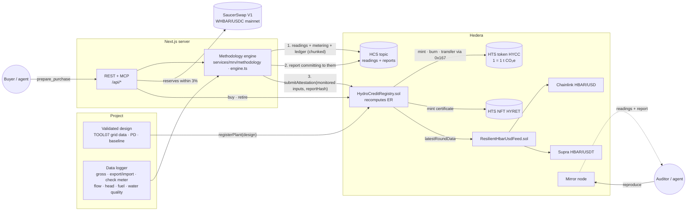

# Methodology

The short path is the [README](../README.md). This page is the equations, the engine, and the HCS reproduction.

## Why this template exists

Small hydropower plants earn carbon credits, but the evidence behind them is usually a spreadsheet checked once a
year, and many digital MRV prototypes stop at `MWh × grid factor`. That ignores most of the methodology: project
emissions from reservoirs and diesel generators, leakage, retrofit baselines, how the grid factor itself is derived,
and the conservative treatment of bad or missing data. This template wires the whole chain together:

- **The methodology, not an approximation.** TOOL07 builds the grid emission factor from per-unit data, TOOL03 prices
  fuel burnt on site, the power-density rule decides reservoir emissions and eligibility, retrofits are credited only
  above EG_historical + σ. Every equation has a hand-checked test.
- **Conservative by construction.** Gaps count as zero, the lower of two meters wins, expired calibration costs the
  meter's maximum permissible error, physically impossible intervals are credited as zero, baseline emissions round
  down and project emissions round up. Nothing in the pipeline can round a credit into existence.
- **Arithmetic the issuer cannot bypass.** The contract recomputes EG_PJ, BE, PE and ER from the monitored inputs and
  the registered design, with integer arithmetic identical to the engine's. Shared test vectors pin the two together.
- **Verification anyone can reproduce.** Raw readings, metering data and the plant's ledger state go to HCS before the
  report, so the question is not "do you trust the verifier?" but "run it yourself".
- **Settlement and retirement that travel.** USD prices settle in HBAR at an oracle rate two providers must agree on;
  every retirement burns the credits and mints an NFT certificate for an ESG report.

## Methodology

The same code runs in the browser, the REST API, the MCP server and the tests (`packages/nextjs/services/mrv/methodology/`),
and the contract mirrors the quantification step.

Each plant is registered on-chain under one of two rule sets, and the contract applies that plant's factors:

| | **VMR0017 v1.0** (Verra, 23 April 2026; demo plants) | **CDM** (AMS-I.D v18.0 / ACM0002 v22.0) |
| --- | --- | --- |
| Base | "Must be used with ACM0002, v22.0"; ACM0002 applies unless VMR0017 changes it | AMS-I.D up to 15 MW, ACM0002 above |
| Hydro eligibility | 15 MW or less (rated or authorized), Least Developed Countries only (Table 1) | any size, any host country |
| Additionality | VT0008: regulatory surplus, benchmark analysis on project or equity IRR with a sensitivity analysis, common practice (no barrier analysis, no TOOL32) | TOOL01 / TOOL02 at validation |
| EF_Res (reservoirs) | 100 kg CO₂e/MWh (§9.1) | 90 kg CO₂e/MWh |
| Leakage | embodied emissions, 21 g CO₂e/kWh of EG_facility (greenfield) or the higher of EG_PJ and EG_facility × Cap_add / Cap_PJ (capacity addition); none for retrofits (§8.3) | 0 |
| Grid emission factor | VT0011 v1.0 with TOOL07 v7.0: BM over all units including VCS and CDM ones, hydro weights 0.4 / 0.6, then 0.25 / 0.75 | TOOL07 v7.0 |

Verra inactivates ACM0002 and AMS-I.D as standalone methodologies on 1 January 2027, so new projects register under
VMR0017. The CDM path stays for existing registrations and for comparison. It is not a VCS registration: the scope note allows grid hydro only at 15 MW or less in a UN Least Developed Country, which is the VMR0017 path. `assessProject` reports that as `vcs.inScope`. The contract stores the methodology code and the design hash. It does not store the host country. The **Methodology** page (`/methodology`) shows all of it on the demo
data, and the MCP resource `hydro-dmrv://methodology` gives it to agents.

### Emission reductions

```
ER_y  = BE_y − PE_y − LE_y
BE_y  = EG_PJ,y × EF_grid,CM,y                        rounded down
PE_y  = PE_FF,y + PE_HP,y                             rounded up
Imports are subtracted from export before BE. VT0010 would instead charge EC × EF × (1 + TDL) (20% unless the grid publishes a loss). That term is implemented as `projectElectricityG` and is not minted: the registry recomputes from the meter net.
PE_FF = Σ FC × COEF,  COEF = NCV × EF_CO2             TOOL03 option B, IPCC upper 95% bounds
PE_HP = EF_Res × TEG_y  if 4 < PD ≤ 10 W/m², else 0   EF_Res = 100 kg CO2e/MWh (VMR0017), 90 (CDM)
LE_y  = EG × EF_embodied                              VMR0017: 21 g CO2e/kWh; EG_facility (greenfield) or
                                                      the higher of EG_PJ and EG_facility × Cap_add / Cap_PJ
                                                      (capacity addition), never negative; 0 for retrofits
LE_y  = 0                                             CDM: ACM0002; AMS-I.D without transferred equipment

EG_PJ,y = EG_facility,y                               greenfield
EG_PJ,y = EG_facility,y − (EG_historical + σ)         retrofit, capacity addition; 0 after DATE_BaselineRetrofit
EG_facility = export − import at the grid meter, after QA/QC;  TEG = gross generation
```

- **Retrofits** use the mean and the *sample* standard deviation of at least five years of history. The annual
  equation is applied cumulatively within each crediting year: nothing is credited until the year's generation passes
  EG_historical + σ, never more than the excess, and the count restarts each crediting year.
- **Negative periods** (a week of import only, diesel during an outage) are carried forward as a deficit and netted
  against later issuance. Sub-kilogram remainders carry too.
- **Units** are integers everywhere that matters: Wh, g CO₂e, g CO₂/MWh, g of fuel, g CO₂ per tonne of fuel.

### Applicability

| Condition | Rule | Enforced by |
| --- | --- | --- |
| Methodology | registered per plant: VMR0017 (0/1 on-chain) or CDM (AMS-I.D up to 15 MW, ACM0002 above) | engine **and contract** |
| VMR0017 Table 1 | hydro 15 MW or less (contract reverts `MethodologyNotApplicable`); host country on the UN LDC list at the crediting start (`methodology/ldc.ts`, 44 countries, with the 2026 graduations) | contract · engine |
| VMR0017 additionality | VT0008 evidence recorded in the design document (hashed on-chain): regulatory surplus; IRR without carbon revenue below the benchmark, confirmed by the sensitivity analysis; not common practice (F = 1 − N_diff / N_all > 20% **and** N_all − N_diff > 3 fails). Whether the CCP conditions (decisive increase, IRR with credits reaching the benchmark) are met is recorded, as VMR0017 §7 asks | engine (a VVB determines it) |
| Reservoir power density `PD = (Cap_PJ − Cap_BL) / (A_PJ − A_BL)` | PD ≤ 4 W/m² not eligible; 4 < PD ≤ 10 → PE_HP; PD > 10 or no new area → 0 | engine **and contract** |
| Project type | greenfield has no baseline; retrofits need Cap_BL, EG_historical + σ and DATE_BaselineRetrofit; additions must add capacity | engine **and contract** |
| Leakage | VMR0017: embodied emissions computed by the contract; AMS-I.D with transferred equipment needs a leakage assessment: refused | engine **and contract** |
| Crediting period | exactly 5, 7 or 10 × 365-day years. VMR0017 from 1 Jan 2027 is 5 years, renewable at most twice; a 10-year period is fixed. Periods stay inside it and inside one crediting year | engine **and contract** |

### Grid emission factor (TOOL07 and VT0011, ex-ante)

```
EF_grid,CM = w_OM × EF_grid,OM + w_BM × EF_grid,BM
```

- **Operating margin**: simple OM (only when low-cost/must-run sources supply < 50% on a five-year average; the engine
  refuses otherwise), simple adjusted OM `(1 − λ) × EF_non-LCMR + λ × EF_LCMR`, or average OM. Per-unit option A:
  **A1** `Σ FC × NCV × EF_CO2 / EG` or **A2** `EF_CO2 × 3.6 / η`. Three-year generation-weighted average.
- **Build margin**: sample group per TOOL07 step 5 — the larger of the five most recent units and the most recent
  units supplying ≥ 20% of generation (CDM units excluded); if that set holds units older than 10 years, drop them,
  add CDM units, then older units, up to 20%.
- **Weights**: hydro 0.5 / 0.5 in the first crediting period and 0.25 / 0.75 after renewal; wind and solar 0.75 / 0.25.
- **VT0011** (VMR0017 plants) changes TOOL07 where it matters for the number: the BM sample is the larger of the
  two sets over *all* units, those registered under the VCS or any other GHG program included, with steps (d)–(f)
  removed (¶75); a sample unit older than 10 years must use option A2 with its TOOL09 Table 2 default efficiency
  (`tool09Efficiency`, refused without it, ¶79); a unit with generation data only counts as 0 t/MWh (option A3,
  ¶50); and the weights are 0.4 / 0.6 for hydro in the first crediting period and 0.25 / 0.75 after it (¶86; wind and
  solar 0.5 / 0.5, 0.4 / 0.6, 0.3 / 0.7). The optional ¶90 (w_OM = 1 in an LDC) and ¶91 (default BM) are not offered:
  ¶90 would raise the factor.
- **IPCC defaults**: the **lower** 95% bound for the baseline (TOOL07) and the **upper** bound for project emissions
  (TOOL03), so neither side can inflate credits. A combined margin published by a DNA can be registered instead.

The demo plants sit on an **illustrative** 13-unit grid (coal, gas, oil, hydro, wind, solar, one CDM unit). Under
VT0011: simple OM 0.769 t/MWh, BM 0.443 t/MWh, so CM 0.573 t/MWh in a first crediting period and 0.524 t/MWh after
renewal. TOOL07 would give BM 0.462 and CM 0.615 / 0.539 on the same grid; its 0.5 / 0.5 weights and the exclusion of
the CDM solar unit from the BM overstate the factor by about 7% for a first-period plant.

### Monitoring QA/QC

| Data | Treatment |
| --- | --- |
| Source | when the metering record names a meter key (`deviceAddress`), the batch must carry that key's signed meter statement; missing, wrong key, another registry or any reading edited after signing → **REJECTED**. The contract checks the same signature against the meter registered with the plant |
| Timestamps | duplicates, out-of-order or overlapping intervals → **REJECTED** (double counting) |
| Gaps | credited as zero; coverage < 90% → FLAGGED; the contract refuses < 90% too |
| Main vs check meter | disagreement beyond their combined accuracy → lower reading used, FLAGGED |
| Calibration expired | export × (1 − MPE), import × (1 + MPE) |
| No metering record | class 0.5 meters with unverifiable calibration are assumed, so the MPE deduction applies |
| Export above generation | the excess is never credited |
| Physics | generation above nameplate, or above ρ·g·Q·H·η_max widened by the flow meter's uncertainty → interval credited as zero, FLAGGED; > 20% of intervals → **REJECTED** |
| Efficiency outliers | modified z-score ≥ 3.5 on water-to-wire efficiency → FLAGGED |
| Fuel | burnt on site with no fuel registered → **REJECTED** (PE_FF cannot be computed) |
| Water quality | pH, turbidity, temperature out of range → FLAGGED for environmental review; quantity unchanged |

### Meter-signed data, enforced on-chain

QA/QC and physics catch readings that are implausible; they cannot catch readings that are plausible but were changed
on the way from the meter, or a verifier who reports more than the meter measured. So the plant's data logger holds a
secp256k1 key, registered on-chain with the plant (`registerPlant(.., meter, ..)`, replaceable only by the admin with
`setPlantMeter`), and signs a **meter statement** for every batch (`services/mrv/provenance.ts`):

```
keccak256(abi.encode("hydro-dmrv/meter-statement@1" tag, chainId, registry, plantId,
                     periodStart, periodEnd, grossWh, netWh, fuelG, sha256(readings)))   → EIP-191 personal_sign
```

The totals are raw, before any QA/QC. Two independent checks use the same signature:

| Where | Check |
| --- | --- |
| Engine (QA/QC stage, and every reproduction from HCS) | the statement matches the readings and was signed by the metering record's key for this registry |
| `HydroCreditRegistry.submitAttestation` | the signer is the plant's registered meter; EG_facility ≤ the metered net export; FC ≥ the metered fuel; TEG = the metered gross, capped only at what the nameplate can produce in the period |

QA/QC may only make figures more conservative, and the contract enforces that direction. A stolen or misbehaving
verifier key cannot mint a period the meter did not sign, inflate export, hide fuel, understate TEG to shrink reservoir
emissions, or replay a statement on another chain or registry. That holds only while the meter key is private. The two
demo plants do not have that property: their keys are derived from the plant id, below.

```bash
yarn mrv:meter-key                                   # new meter key; register its address with the plant
METER_PRIVATE_KEY=0x… yarn mrv:sign request.json     # sign the batch's statement in place, as the logger would
```

Any Ethereum library, hardware wallet or secure element can be the signer. The demo meters' keys are derived from the
plant id and are public on purpose, so sample data is signed; on `/verify`, edit any value and watch QA/QC reject it.
A real meter's key never leaves its device.

### Keys and roles

| Key | Can | Cannot | Keep it |
| --- | --- | --- | --- |
| Meter (per plant) | sign what it measured | mint, or change a registration | in the data logger / secure element |
| Verifier (`VERIFIER_ROLE`) | attest periods the meter signed, never more generous | register plants, change meters, move anyone's credits | on the attesting server |
| Admin (`DEFAULT_ADMIN_ROLE`) | register plants and meters, renew crediting periods, grant roles | move anyone's credits, or mint without a statement from the meter it registered | a Hedera account with a threshold key, e.g. 2 of 3 |
| Buyers and agents | buy, retire, withdraw with their own wallet | anything else | their own wallet; the app never asks for it |

`yarn deploy` does the split when `VERIFIER_ADDRESS` and `ADMIN_ADDRESS` are set: the verifier gets
`VERIFIER_ROLE` and the deployer loses it, then `ADMIN_ADDRESS` (an EVM address or a Hedera account id such as
`0.0.12345`) gets `DEFAULT_ADMIN_ROLE` and the deployer renounces it. A Hedera account whose key is a threshold
`KeyList` needs several signatures on every admin transaction (HAPI `ContractExecuteTransaction`), so no single
person can register a plant or swap a meter.

### How this compares with Guardian's digitised policies

While building the engine we read the calculation blocks of the CDM ACM0002 and AMS-I.D policies and Tools 03, 05
and 07 in Guardian's Methodology Library (`Methodology Library/Clean Development Mechanism (CDM)/`, as of
guardian@3529a83). Where this implementation deliberately differs:

| Topic | Guardian policy calculation block | This template |
| --- | --- | --- |
| Reservoir emissions (ACM0002) | `H61 = power_density.G3` passes the power density in W/m² into project emissions; the computed emissions are in `G8` | PE_HP in g CO₂e from EF_Res × TEG |
| PD ≤ 4 W/m² (ACM0002, AMS-I.D) | returns PE_HP = 0, the same as PD > 10 | not eligible; the contract reverts `PowerDensityTooLow` |
| Retrofit (ACM0002) | `EG_PJ = G9 − (G10 + G11)` with no DATE_BaselineRetrofit branch | credited per crediting year, zero after DATE_BaselineRetrofit |
| Capacity addition (ACM0002) | reads `capacity.G3`, which the block never computes | same baseline equation as retrofits, with required inputs |
| Invalid arithmetic | `adjustValues` silently turns NaN and ±∞ into 0 | inputs validated with zod; integer arithmetic; errors surface |

These are worth reporting upstream; Guardian remains the right home for full VVB workflows.

## Architecture



The sequence for one day of monitoring:

1. **Register** (once per crediting period). `assessProject` checks the design and derives the integers the contract
   stores: grid EF from TOOL07, TOOL03 COEF, EG_historical + σ, crediting dates. `registerPlant` re-checks the power
   density and baseline rules and stores them with `designHash`, the SHA-256 of the design document.
2. **Verify.** The engine runs the five stages against the registered design and the plant's **on-chain ledger**.
   Anything but APPROVED stops the server path. A direct `submitAttestation` still has to pass the contract: the meter
   statement, the period, the nameplate, and the quantification. It does not re-run every engine stage.
3. **Agree.** `submitAttestation` is simulated, and the contract's own `quantify()` must return the engine's ER and
   credits to the gram. A disagreement stops the pipeline before anything is published.
4. **Anchor.** The raw readings, plant profile, metering data and ledger go to HCS (up to 20 chunks), then the report,
   which commits to them by SHA-256 and sequence number.
5. **Issue.** `submitAttestation` records the monitored inputs (EG_facility, TEG, fuel, leakage, completeness), recomputes
   EG_PJ, BE, PE_HP, PE_FF and ER, carries the remainder or deficit, and mints credits into the operator's custody.
6. **Trade and retire.** Sellers list in USD per tonne. The purchase builder reads the SaucerSwap WHBAR/USDC reserves and returns no transaction if that spot is more than 3% from the settlement price. The contract then charges HBAR at the oracle price. Retiring burns the credits and mints an NFT certificate.
7. **Reproduce.** **Check evidence** fetches both messages from the mirror node, verifies both hashes, checks the data
   used the registered design, re-runs the engine and compares every figure with the chain.

### Why each integration is load-bearing

| Piece | Remove it and… |
| --- | --- |
| **HCS readings + report** | The quantification becomes an unverifiable claim. With both on HCS, a verifier who approves bad data, or uses a flattering grid factor, is caught by anyone who re-runs the engine. |
| **Contract quantification + HTS** | Credits would be whatever the verifier typed. Because the contract recomputes ER and is the only supply key, nothing can be minted outside the registered design and the equations. |
| **Chainlink + Supra** | USD-denominated settlement is impossible on-chain. With one feed, a single outage halts the market and a single bad answer misprices it. Two providers that must agree remove both failure modes. |
| **SaucerSwap WHBAR/USDC** | `prepare_purchase` and `get_dex_price` stop. The template's market, the agent tools and the UI will not build a buy. A direct call to the registry still settles on the two oracles; that bypass is documented under limitations. |

## The 5-stage verification engine

`packages/nextjs/services/mrv/engine.ts` is pure TypeScript with no I/O. Findings are `reject`, `review` or `info`;
quantities are already conservative, so findings decide whether a human must look, never how much is credited.

| Stage | Checks |
| --- | --- |
| 1. Applicability & crediting period | power density rule, crediting period, one crediting year, registered fuel |
| 2. Monitoring data QA/QC | replays and overlaps, gaps and coverage, main/check meter reconciliation, delayed calibration |
| 3. Physical cross-checks | nameplate, ρ·g·Q·H·η_max, export ≤ generation, flow and head envelope, efficiency outliers |
| 4. Emission reductions | EG_facility, TEG, FC → EG_PJ, BE, PE_HP, PE_FF, LE, ER, credits (`methodology/quantify.ts`) |
| 5. Environmental safeguards | water quality for review; never changes the quantity |

**Decision:** any `reject` → REJECTED; otherwise any `review` → FLAGGED; otherwise APPROVED. Only APPROVED periods
can be attested.

Scenarios on the run-of-river demo plant (500 kW, day ending at midnight UTC):

| Scenario | What it simulates | Outcome |
| --- | --- | --- |
| `healthy` | 24 h of normal operation, main and check meters agree | APPROVED · BE 4.973 t, LE 0.182 t, ER 4.791 t CO₂e |
| `diesel-backup` | 3 h grid outage, diesel generator for auxiliaries | APPROVED · PE_FF 0.240 t, ER 3.933 t |
| `calibration-overdue` | main meter's calibration expired | APPROVED · export −0.2% (MPE), ER 4.782 t |
| `meter-drift` | main meter reads 1.5% above the check meter for 6 h | FLAGGED · lower reading used |
| `data-gaps` | 4 h missing | FLAGGED · 83.3% coverage, gaps credited as zero |
| `spikes` | 3 intervals above the hydraulic potential | FLAGGED · those intervals credited as zero |
| `polluted` | acidic, very turbid water | FLAGGED · quantity unchanged |
| `inflated` | every interval 35% above what the water can produce | REJECTED |
| `replay` | four hours re-submitted with duplicate timestamps | REJECTED |
| `tampered` | main and check meter raised 1% in six hours *after* the meter signed: meters agree, physics is plausible | REJECTED (signature) |

The storage demo plant (12 MW, new 1.8 km² reservoir, PD 6.67 W/m², second crediting period) shows reservoir
emissions: under VMR0017 a healthy day is about 208 MWh net, BE 109.2 t, PE_HP 21.1 t (EF_Res 100 kg/MWh), LE 4.4 t
(embodied emissions), ER 83.7 t.

## Public re-verification on HCS

Two message types go to the audit topic (`services/mrv/report.ts`):

| Message | Schema | Contents | Size |
| --- | --- | --- | --- |
| Data | `hydro-dmrv/readings@5` | Every reading, the meter's signed statement and the registry it was signed for (`domain`), the plant profile (registered design + hydraulics), metering data including the meter's address, the plant's ledger before the period, engine version. `readings@2` (before meter signatures), `readings@3` (before VMR0017) and `readings@4` (batch signatures) are still reproduced. | 4 chunks for a day, 16 for a week; HCS caps a message at 20 |
| Report | `hydro-dmrv/report@4` | Decision, coverage, monitored inputs (EG_facility, TEG, FC, LE), EG_PJ, BE, PE_HP, PE_FF, LE (with VMR0017 embodied emissions), ER, credits, parameters, `plantSequence`, and `data: { hash, sequence }` | 1 chunk (~700 bytes) |

`reproduceAttestation` (`services/mrv/audit.ts`) runs these checks:

1. **Report vs chain.** `sha256(report) == reportHash`, then every monitored input and every computed figure against
   what the contract stored. This catches a verifier who anchors one report and attests different numbers.
2. **Data vs report.** Reassemble the chunked data message (matched by initial transaction id, ordered by chunk
   number, so interleaved messages cannot corrupt it) and check its hash against `report.data.hash`.
3. **Design vs registration.** The plant design inside the data message must equal the on-chain registration, so a
   verifier cannot quantify with a flattering grid factor, and the meter in the metering record must be the plant's
   registered meter.
4. **Figures vs data.** Re-run the engine and compare decision, coverage, EG_facility, TEG, fuel, EG_PJ, BE, PE, ER and
   credits with the report. The re-run checks the meter's signature too, so readings edited after the meter signed
   them fail reproduction even when the report was computed from the edited values.

The same function backs the Audit page, `GET /api/registry/attestations/{id}/reproduce` and the
`reproduce_attestation` MCP tool, and needs no credentials. The design documents themselves are served at
`/api/methodology/projects/{plantId}?raw=1`, whose SHA-256 is the on-chain `designHash`.
